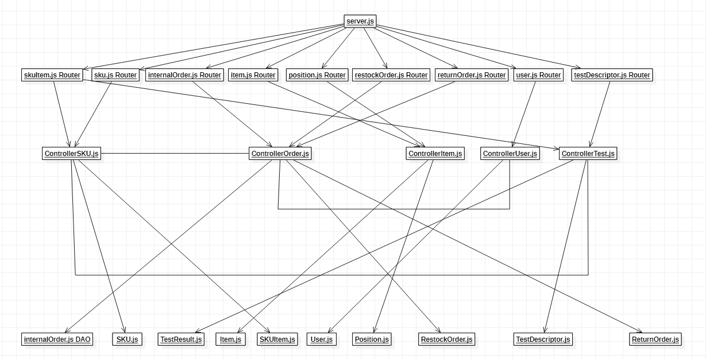

# Integration and API Test Report

Date:

Version:

# Contents

- [Dependency graph](#dependency graph)

- [Integration and API Test Report](#integration-and-api-test-report)
- [Contents](#contents)
- [Dependency graph](#dependency-graph)
- [Integration approach](#integration-approach)
- [Integration Tests](#integration-tests)
  - [Step 1](#step-1)
  - [Step 2](#step-2)
  - [Step n](#step-n)
- [API testing - Scenarios](#api-testing---scenarios)
  - [Scenario 1-1](#scenario-1-1)
  - [Scenario 1-2](#scenario-1-2)
  - [Scenario 1-3](#scenario-1-3)
  - [Scenario 2-1](#scenario-2-1)
  - [Scenario 2-2](#scenario-2-2)
  - [Scenario 2-3](#scenario-2-3)
  - [Scenario 2-4](#scenario-2-4)
  - [Scenario 11-1](#scenario-11-1)
  - [Scenario 11-2](#scenario-11-2)
  - [Scenario 12-1](#scenario-12-1)
  - [Scenario 12-2](#scenario-12-2)
  - [Scenario 4-1](#scenario-4-1)
  - [Scenario 4-2](#scenario-4-2)
  - [Scenario 4-3](#scenario-4-3)
  - [Scenario 7-1](#scenario-7-1)
  - [Scenario 7-2](#scenario-7-2)
- [Coverage of Scenarios and FR](#coverage-of-scenarios-and-fr)
- [Coverage of Non Functional Requirements](#coverage-of-non-functional-requirements)
    - 

- [Tests](#tests)

- [Scenarios](#scenarios)

- [Coverage of scenarios and FR](#scenario-coverage)
- [Coverage of non-functional requirements](#nfr-coverage)

# Dependency graph 

     
# Integration approach

   BAsically we used a bottom up approach. We started from the leaf classes (DAO) , then we incrementaly add the upper classes (Router and Controller).

   Step 1 = DAO
   Step 2 = DAO + Controller
   Step 3 = DAO + Controller + Router
    

# API testing - Scenarios

## Scenario 1-1

| Scenario |  Create SKU S |
| ------------- |:-------------:| 
|  Precondition     | Manager M exists and is logged in |
|  Post condition     | S  into the system and with an assigned ID and a location  |
| Step#        | Description  |
|  1    |  M inserts new SKU description |  
|  2    |  M inserts new weight |
|  3    |  M inserts new volume |
|  4    |  M inserts new SKU notes |
|  5    |  M confirms the entered data |

## Scenario 1-2

| Scenario |  Modify SKU location |
| ------------- |:-------------:| 
|  Precondition     | Manager M exists and is logged in |
|  | SKU S exists |
|  | Position P is not assigned to any SKU |
|  Post condition     | S.position = P |
| Step#        | Description  |
|  1    |  M searches S via ID |
|  2    |  M selects S's record |
|  3    | System provide free positions capable to store the SKU quantity |
|  4    |  M selects a new SKU position |
|  5    |  M confirms the modifications |

## Scenario 1-3

| Scenario |  Modify SKU weight and volume |
| ------------- |:-------------:| 
|  Precondition     | Manager M exists and is logged in |
|  | SKU S exists |
|  Post condition     | Weight and or volume of S updated |
| Step#        | Description  |
|  1    |  M searches S via ID |
|  2    |  M selects S's record |
|  3    |  M selects new value for S's weight |
|  4    |  M selects new value for S's volume |
|  5    |  M confirms the modifications |

## Scenario 2-1

| Scenario |  Create position |
| ------------- |:-------------:| 
|  Precondition     | Manager M exists and is logged in |
|  Post condition     | Position P is created with zero occupied weight and volume |
| Step#        | Description  |
|  1    |  M defines aisle ID, row and column for P |  
|  2    |  M defines positionID for P |
|  3    |  M defines max weight for P |
|  4    |  M defines max volume for P |
|  5    |  M confirms the inserted data |

## Scenario 2-2

| Scenario |  Modify positionID of P |
| ------------- |:-------------:| 
|  Precondition     | Manager M exists and is logged in |
||Position P exists|
|  Post condition     | P's positionID updated |
| Step#        | Description  |
|  1    |  M selects position P |  
|  2    |  M defines new positionID for P |
|  3   |  M confirms the inserted data |
| 4 | System updates aisleID, row and col|

## Scenario 2-3

| Scenario |  Modify weight and volume of P |
| ------------- |:-------------:| 
|  Precondition     | Manager M exists and is logged in |
||Position P exists|
|  Post condition     | P's weight and volume updated |
| Step#        | Description  |
|  1    |  M selects position P |  
|  2    |  M defines new weight for P |
|  3    |  M defines new volume for P |
|  4  |  M confirms the inserted data |

## Scenario 2-4

| Scenario |  Modify aisle ID, row and column of P |
| ------------- |:-------------:| 
|  Precondition     | Manager M exists and is logged in |
||Position P exists|
|  Post condition     | P's aisle ID, row and column updated |
| Step#        | Description  |
|  1    |  M selects position P |  
|  2    |  M defines new aisle ID for P |
|  3    |  M defines new row for P |
|  4    |  M defines new column for P |
|  5   |  M confirms the inserted data |
| 6 | System modify positionID |

## Scenario 11-1

| Scenario |  Create Item I |
| ------------- |:-------------:| 
|  Precondition     | Supplier S exists and is logged in |
|  Post condition     | I into the system and with an assigned ID  |
| Step#        | Description  |
|  1    |  S inserts new Item description |  
|  2    |  S inserts identifier of corresponding SKU |
|  3    |  S inserts new price |
|  4    |  S confirms the entered data |

## Scenario 11-2

| Scenario |  Modify Item description and price |
| ------------- |:-------------:| 
|  Precondition     | Supplier S exists and is logged in |
|  | Item I exists |
|  Post condition     | Description and or price of I updated |
| Step#        | Description  |
|  1    |  S searches I via ID |
|  2    |  S selects I's record |
|  3    |  S selects new value for I's description |
|  4    |  S selects new value for I's price |
|  5    |  S confirms the modifications |

## Scenario 12-1

| Scenario |  Create test description |
| ------------- |:-------------:| 
|  Precondition     | Manager M exists and is logged in |
| | SKU S exists |
|  Post condition     | Test description is created |
| Step#        | Description  |
|1| M defines name for T |
| 2 |M selects S for T |
|  3    |  M defines procedure description for T |  
|  4    |  M confirms the inserted data |

## Scenario 12-2

| Scenario |  Update test description |
| ------------- |:-------------:| 
|  Precondition     | Manager M exists and is logged in |
|       | Test description T exists |
|  Post condition     | Test description updated |
| Step#        | Description  |
|  1    |  M selects test description T |  
| 2     |  M updates procedure description|
|  3    |  M confirms the updated data |
## Scenario 4-1

| Scenario |  Create user and define rights |
| ------------- |:-------------:| 
|  Precondition     | Admin A exists and is logged in |
|  Post condition     | Account X is created |
| Step#        | Description  |
|  1    |  A defines the credentials of the new Account X |  
|  2    |  A selects the access rights for the new account X |
|  3    |  A confirms the inserted data |

## Scenario 4-2

| Scenario |  Modify user rights |
| ------------- |:-------------:| 
|  Precondition     | Admin A exists and is logged in |
|  | Account X exists |
|  Post condition     | X's rights updated |
| Step#        | Description  |
|  1    |  A selects account X  |
|  2    |  A selects the access rights for X |
|  3    |  A confirms the inserted data |

## Scenario 4-3

| Scenario |  Delete user |
| ------------- |:-------------:| 
|  Precondition     | Admin A exists and is logged in |
|  | Account X exists |
|  Post condition     | Account X deleted |
| Step#        | Description  |
|  1    |  A selects account X  |
|  2    |  X deleted from the system |

## Scenario 7-1

| Scenario |  Login |
| ------------- |:-------------:| 
|  Precondition     | Account  for User U existing  |
|  Post condition     | U logged in  |
| Step#        | Description  |
|  1    |  User inserts his username |
|  2    |  User inserts his password |
|  3    |  User logged in,  system shows the functionalities offered by the access priviledges of  U |

## Scenario 7-2

| Scenario |  Logout |
| ------------- |:-------------:| 
|  Precondition     | U logged-in  |
|  Post condition     | U logged-out  |
| Step#        | Description  |
|  1    |  U logs out |
|  2    |  The system shows the login/sign in page | 

# Coverage of Scenarios and FR

<Report in the following table the coverage of scenarios (from official requirements and from above) vs FR. 
Report also for each of the scenarios the (one or more) API Mocha tests that cover it. >  Mocha test cases should be here code/server/test

| Scenario ID | Functional Requirements covered | Mocha  Test(s) | 
| ----------- | ------------------------------- | ----------- | 
| 1.* | FR2 | testSKURouter.js |
|  2.1        | FR3.1.1                         |testPositonRouter.js   |             
|  2.2-2.3-2.4 | FR3.1.1 - FR3.1.4              |testPositionRouter.js  |     
| 3.* - 5.1.1 - 5.3.* | FR5 | testRestockOrderRouter.js |
| 6.* | FR5 | testReturnOrderRouter.js |
| 4.* | FR1 - FR4 | testUserRouter.js |
| 7.* | - | testUserRouter.js |
| 9.* | FR6 | testInternalOrder.js|
| 11.1-11.2    | FR7                        |testItemRouter.js             |             
| 4.1 -4.2-4.3-7.1-7.2| FR1.1-FR1.1-FR1.2-FR1.3-FR1.4-FR1.5|testUserRouter.js       |             
| 12.1-12.2      |  FR2.1-FR2.2                               |             |             
| ...         |                                 |             |             

# Coverage of Non Functional Requirements

<Report in the following table the coverage of the Non Functional Requirements of the application - only those that can be tested with automated testing frameworks.>

### 

| Non Functional Requirement | Test name |
| -------------------------- | --------- |
|    NFR2                      |   all test          |
|    NFR4                     |    testPositionRouter.js        |
|    NFR5                     |    testSKURouter.js/testSKUItemRouter.js        |
|    NFR6                     |    testSKURouter.js/testSKUItemRouter.js        |
|    NFR7/NFR8                     |    testPositionRouter.js        |
|    NFR9                     |    testSKUItemRouter.js/testResultRouter.js        |

