# Design Document 

Authors: Michele Cerra, Cihan Yurtsever, Francesco Dell'Agata, Matteo Panigati

Date: 23.04.2022

Version: 0.1.0

# Contents

- [Design Document](#design-document)
- [Contents](#contents)
- [Instructions](#instructions)
- [High level design](#high-level-design)
- [Low level design](#low-level-design)
- [Verification traceability matrix](#verification-traceability-matrix)
- [Verification sequence diagrams](#verification-sequence-diagrams)
- [Sequence Diagram 1-2 : Modify SKU location](#sequence-diagram-1-2--modify-sku-location)
- [Sequence Diagram 2-1 : Create position](#sequence-diagram-2-1--create-position)
- [Sequence Diagram 3-2 : Restock Order of SKU S issued by supplier](#sequence-diagram-3-2--restock-order-of-sku-s-issued-by-supplier)
- [Sequence Diagram 5-1-1 : Record restock order arrival](#sequence-diagram-5-1-1--record-restock-order-arrival)
- [Sequence Diagram 5-2-3 : Record negative and positive test results of all SKU items of a RestockOrder](#sequence-diagram-5-2-3--record-negative-and-positive-test-results-of-all-sku-items-of-a-restockorder)
- [Sequence Diagram 5-3-3 : Stock some SKU items of a RO](#sequence-diagram-5-3-3--stock-some-sku-items-of-a-ro)
- [Sequence Diagram 6-2 : Return order of any SKU items](#sequence-diagram-6-2--return-order-of-any-sku-items)
- [Sequence Diagram 9-1 : Internal Order IO accepted](#sequence-diagram-9-1--internal-order-io-accepted)
- [Sequence Diagram 10-1 : Internal Order IO Completed](#sequence-diagram-10-1--internal-order-io-completed)
- [Sequence Diagram 11-1 : Create Item I](#sequence-diagram-11-1--create-item-i)
- [Sequence Diagram 12-1 : Create test description](#sequence-diagram-12-1--create-test-description)

# Instructions

The design must satisfy the Official Requirements document, notably functional and non functional requirements, and be consistent with the APIs

# High level design 

The architectural pattern used is the client-server model. So client can access to the server only through  browser, using a device.

The server is composed by: 

- the frontend, which is developed with web technologies (JavaScript, HTML, Css) and is in charge of collecting user inputs to send requests to the backend

- the backend

Together, they implement a layered style: Presentation layer (front end), Application logic and data layer (back end).
Together, they implement also an MVC pattern, with the V on the front end and the MC on the back end. Because the application must present cosistend data, and the data may change at runtime.

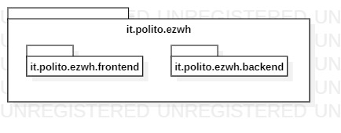

# Low level design
Design pattern used:
  1) Warehouse : Singleton, Façade
  2) DatabaseHelper : Singleton

```plantuml
@startuml classDiagram

class EZWHServer {
    + main()
}


class Express {
}

class callCtrlCheckErr{
}


package "Controllers" #DDDDDD{

class HTTPError{
}
class Warehouse {
    - {static} whSingle : Warehouse
    + SKUCtrl : SKUController
    + UserCtrl : UserController
    + ItemCtrl : ItemController
    + TestCtrl : TestController
    + OrderCtrl : OrderController
    __
    + constructor()
    + {static} getInstance() : Warehouse
    + createTables()
    + hasPermissions(...args)
}

class SKUController {
    - wh : Warehouse
    - SKUDao : SKU
    - SKUItemDao : SKUItem
    __
    + constructor(wh, SKUDao, SKUITemDao)
    + createTables()
    ..
    + getSKUs() 
    + getSKUById(skuid) 
    + postSKU(newSKU)
    + putSKU(oldSkuId, skuMod)
    + putSKUPosition(skuId, positionId)
    + deleteSKU(skuId)
    ..
    + getSKUItems()
    + getSKUItemsBySKUId(skuId) 
    + getSKUItem(RFID)
    + postSKUItem(newSkuItem) 
    + putSKUItem(RFID, skuMod)
    + deleteSKUItem(RFID)
    ..
    + getSKUItemsByInternalOrderId(internalOrderId)
    + getSKUItemsByRestockOrderId(restockOrderId)
    + getSKUItemsByReturnOrderId(returnOrderId)
    + setIntOrd(RFID, intOrdId)
    + setRestockOrd(RFID, restockOrdId, itemId)
    + setReturnOrd(RFID, returnOrderId)
}

class TestController {
    - wh : Warehouse
    - TestDescriptorDao : TestDescriptor
    - TestResultDao : TestResult
    __
    + constructor(wh, TestDescriptorDao, TestResultDao)
    + createTables()
    ..
    + getTestResults(rfid)
    + getTestResultById(rfid, id)
    + postTestResult(newTestResult)
    + putTestResult(rfid, id, testMod) 
    + deleteTestResult(rfid, id)
    ..
    + getTestDescriptors()
    + getTestDescriptor(id)
    + getTestDescriptorBySKUId(idSKU)
    + postTestDescriptor(newTestDescriptor)
    + putTestDescriptor(id, testMod)
    + deleteTestDescriptor(id)
}

class UserController {
    - wh : Warehouse
    - isLogged : Boolean
    - currUser : User
    - userDao : User
    __
    + constructor()
    + createTables()
    .. 
    + getSuppliers()
    + getUsers()
    + getUser()
    - getUserByEmailType(email, type)
    - checkType(type : String)
    + postNewUser(newUser)
    + putUser(email, userMod)
    + deleteUser(email, type)
    ..
    + getUserInfo()
    + session(email, password, type)
    + logout()
}

class ItemController {
    - wh : Warehouse
    - ItemDao : Item
    - PositionDao : Position
    __
    + constructor(wh,ItemDao,PositionDao)
    + createTables()
    ..
    + getItems()
    + getItem(id)
    + getItemsBySupplId(supplierId)
    + getItemBySKUIdAndSupplId(skuId, supplierId)
    + postItem(newid)
    + putItem(id, itemMod)
    + deleteItem(id)
    ..
    + getPositions()
    + getPosition(positionID)
    + postPosition(newPosition)
    + putPosition(positionID, posMod)
    + putPositionChangeID(positionID, posMod)
    + deletePosition(positionID)
}

class OrderController {
    - wh : Warehouse
    - restockOrdDato : RestockOrder
    - internalOrdDao : InternalOrder
    - returnOrdDao : ReturnOrder
    __
    + constructor(wh, restockOrderDao, returnOrderDao, internalOrderDao)
    + createTable()
    ..
    + getTransportNote(id)
    + postTransportNote(transportNote)
    ..
    - mapAndFillRestOrder(restockOrders, state)
    + getRestockOrders(state = undefined)
    + getRestockOrder(id)
    + getRestockOrderReturnItems(id)
    + postRestockOrder(newRestOrd)
    + putRestockOrderState(id, newState)
    + putRestockOrderSKUItems(id, skuItems)
    + putRestockOrderTranspNote(id, transpNote)
    + deleteRestockOrder(id)
    ..
    - mapAndFillReturnOrder(returnOrders)
    + getReturnOrders()
    + getReturnOrder(id)
    + postReturnOrder(newReturnOrder)
    + deleteReturnOrder(id)
    ..  
    - mapAndFillIntOrder(internalOrders, state)
    + getInternalOrders(state = undefined)
    + getInternalOrder(id)
    + postInternalOrder(newIntOrd)
    + putInternalOrder(id, body)
    + deleteInternalOrder(id)
}

}
package "Database" <<Database>> {
class DatabaseHelper {
    + db
    ..
    + constructor(pathSQLite)
    __
    + queryDBAll(sql, data=[])
    + queryDBRun(sql, data=[])
}
class Sqlite {
    + run() : void
    + all() : void
}
}
package "DAO" {
    
    class SKU {
        - Id : Integer
        - description : String
        - weight : Double
        - volume : Double
        - notes : String
        - position : String
        - availableQuantity : Integer
        - price : Double
        __
        + createTable() : void
        + deleteTable() : void
        + buildSKU(rows) : SKU
        + getSKUs() : Array<Sku>
        + getSKUById(id) : SKU
        + insertNewSKU(newSKU) : void
        + updateSKU(SKU) : void
        + updateSKUPosition(SKUid, positionId) : void 
        + deleteSKU(SKUid) : void
    }

    class SKUItem {
        - RFID : String
        - SKUId : Integer
        - itemId : Integer
        - available : Boolean
        - dateOfStock : String
        - restockOrderId : Integer
        - returnOrderId : Integer
        - internalOrderId : Integer
        __
        + buildSkuItem(rows) : SKUItem
        + createTable() : void
        + deleteTable() : void
        + getSKuItems() : Array<SKUItem>
        + getSKUItemById(SKUid) : SKUItem
        + getSKUItemByRFID(RFID) : SKUItem
        + getSKUItemByInternalOrderID(internalOrderId) : SKUItem
        + getSKUItemByRestockOrderID(RestockOrderId) : SKUItem
        + getSKUItemByReturnOrderID(ReturnOrderId) : SKUItem 
        + insertNewSkuItem(SKUItem) : void
        + insertInternalOrderID(RFID, internalOrderId) : SKUItem
        + insertRestockOrderID(RFID, RestockOrderId, itemId) : SKUItem
        + insertReturnOrderID(RFID, ReturnOrderId) : SKUItem
        + updateSKUItem(SKUmod, RFID) : void
        + deleteSKUItem(RFID) : void
        + deleteSKUItemData() : void
    }


    class Item {
        - Id : Intenger
        - description : String
        - price : Double
        - SKUId : Integer
        - supplierId : Integer
        __
        + buildItem(rows) : Item
        + deleteTable() : void
        + createTable() : void
        + getItems() : Array<Item>
        + getItem(id) : Item
        + getItemBYSUpplId(supplierId) : Item
        + getItemBySKUIdAndSupplId(skuid, supplierId) : Item
        + insertNewItem(newid) : void
        + updateItem(itemMod, id) : void
        + deleteItem(id) : void
        + deleteItemData() : void
    }

    class Position {
        - positionID : String
        - aisleID : String
        - row : String
        - col : String
        - maxWeight : Double
        - maxVolume : Double
        - occupiedWeight : Double
        - occupiedVolume : Double
        __
        + buildPosition(rows) : Position
        + createTable() : void
        + deleteTable(): void
        + getPositions() : Array<Positions>
        + getPositionById(positionID) : Position
        + insertNewPosition(newPosition) : void
        + updatePosition(posMod, positionId) : void
        + updatePositionById(posMod, positionID) : void
        + deletePosition(positionID) : void
        + deletePositionData() : void
    }
    class User {
        - userId : Integer
        - name : String
        - surname : String
        - email : String
        - password : String
        - type : String
        __
        + buildUser(rows) : User
        + createTable() : void
        + deleteTable() : void
        + getSUppliers() : Array<User>
        + getUsers() : Array<User>
        + getUSerById(id) : User
        + getUserByEmailType(email, type) : User
        + insertNewUser(newUser) : void
        + insertOrIgnoreNewUser(name, surname, email, password, type) : void
        + updateUser(email, userMod) : void
        + deleteUser(email, type) : void
        + logIn(email, password, type) : User
    }
    enum StateRestock {
        ISSUED
        DELIVERY
        DELIVERED
        TESTED
        COMPLETEDRETURN
        COMPLETED
    }


    class RestockOrder{
        - Id : Integer
        - issueDate : String
        - state : StateRestock
        - supplierId : Integer
        - transportNote : Integer
        - products : Array
        - skuItems : Array
        __
        + buildRestockOrder(rows) : RestockOrder
        + createTableRestockOrder() : void
        + deleteTableRestockOrder() : void
        + getRestockOrder() : Array<RestockOrder>
        + getRestockOrderById(id) : RestockOrder
        + insertNewRestockOrder(newRestOrder) : void
        + updateRestockOrderStatus(id, state) : void
        + updateRestockOrderTransportNote(id, transportNote) : void
        + deleteRestockOrder(id) : void
    }
    class JoinRstkOrdSKU{
        - restockOrderId : Integer
        - SKUId : Integer
        - itemId : Integer
        - description : String
        - price : Double
        - qty : Integer
        __
        + buildJoin(rows) : JoinRstkOrdSKU
        + createTableJoinRstkOrdSKU() : void
        + deleteTableJoinRstkOrdSKU() : void
        + getJoinByRstkOrdId(restockOrderId) : JoinRstkOrdSKU
        + insertJoin(restockOrdId, SKUId, itemId, description, price, qty) : void
        + deleteJoin(restockOrderId) : void
        + deleteJoinTable() : void
        + deleteRestockOrderData() : void
    }

    class TransportNote{
        - id
        - deliveryState
        __
        + buildTransportNote(rows) : TransportNote
        + createTableTransportNote() : void
        + deleteTableTransportNote() : void
        + getTransportNoteById(id) : TransportNote
        + insertTransportNote(transportNote) : void
    }
    
    class ReturnOrder{
        - id : Integer
        - returnDate : String
        - restockOrderId : Integer
        __
        + buildReturnOrder(rows) : ReturnOrder
        + createTable() : void
        + deleteTable() : void
        + getReturnOrders() : Array<ReturnOrder>
        + getReturnOrderById(id) : ReturnOrder
        + insertReturnOrder(newReturnOrder) : void
        + deleteReturnOrder(id) : void
    }
    enum StateInternal {
        ISSUED
        ACCEPTED
        REFUSED
        CANCELED
        COMPLETED
    }
    class InternalOrder{
        - id : Integer
        - issueDate : String
        - state : StateInternal
        - customerId : Integer
        __
        + buildInternalOrder(rows) : InternalOrder
        + createTable() : void
        + deleteTable() : void
        + getInternalOrders() : Array<InternalOrder>
        + getInternalOrderById(id) : InternalOrder
        + insertInternalOrder(newIntOrd) : void
        + updateInternalOrder(id, state) : void
        + deleteInternalOrder(id) : void 
    }

    class JoinIntOrdSKU{
        - internalOrderId : Integer
        - SKUId : Integer
        - description : String
        - price : Double
        - qty : Integer
        __
        + buildJoin(rows) : JoinIntOrdKU
        + createTableJoinINtOrdSKU() : void
        + deleteTableJoinINtOrdSKU() : void
        + getJoinByInterOrdeId(internalOrderId) : JoinIntOrdSKU
        + insertJoin(internalOrderId, SKUId, description, price, qty) : void
        + deleteJoin(internalOrderId) : void
        + deleteJoinTable() : void
    }
    class TestDescriptor{
        - id : Integer
        - name : String
        - procedureDescription : String
        - idSKU : Integer
        __
        + createTable()
        + deleteTable()
        - buildTestDescriptor(rows)
        ..
        + getTestDescriptors()
        + getTestDescriptorById(id)
        + getTestDescriptorBySKUId(SKUId)
        + insertTestDescriptor(newTestDescriptor)
        + updateTestDescriptor(testMod)
        + deleteTestDescriptor(id)
        + deleteTestDescriptorData()
    }
    class TestResult{
        - id : Integer
        - idTestDescriptor : Integer
        - rfid : String
        - Date : String
        - Result : Boolean
        __
        + createTable()
        + deleteTable()
        - buildTestResult()
        __
        ~ getTestResults(rfid)
        ~ getTestResultById(rfid,id)
        ~ insertTestResult(newTestResult)
        ~ updateTestResult(rfid, id, testMod)
        ~ deleteTestResult(rfid, id)
        ~ deleteTestResultData()
    }
}




'left to right direction
'top to bottom direction


'Controllers -down- DAO
'DAO -down- DatabaseHelper

Warehouse o-down- SKUController
Warehouse o-down- TestController
Warehouse o-down- UserController
Warehouse o-down- ItemController
Warehouse o-down- OrderController

SKUController -down- SKU
SKUController -down- SKUItem
ItemController -down- Item
ItemController -down- Position
UserController -down- User
TestController -down- TestResult
TestController -down- TestDescriptor
OrderController -down- RestockOrder
OrderController -down- ReturnOrder
OrderController -down- InternalOrder
RestockOrder -down- JoinRstkOrdSKU
InternalOrder -down- JoinIntOrdSKU
RestockOrder -down- TransportNote
RestockOrder -down- StateRestock
InternalOrder -down- StateInternal

DAO -- Database


Express -down- EZWHServer

EZWHServer -down- callCtrlCheckErr
callCtrlCheckErr -down- Warehouse
DatabaseHelper *-down- Sqlite

@enduml
```

# Verification traceability matrix

| ID       |  Warehouse | SKU  |SKU Item | User | Database| Item | Position| Test Descriptor| Test Result | Return Order | Restock Order | Internal Order | Transport Note|
| ------------- |-------------|-------------|-------------|-------------|-------------|-------------|-------------|-------------|-------------|-------------| -------------|-------------|-------------|
| FR1       | X |  |  | X | X |  |  |  |  |  |   |   |  |
| FR2       | X | X | X |  | X |  |  |  |  |  |   |   |  |
| FR3       |  X |  |  |  | X | X | X | X | X |  |   |   |  |
| FR4       | X |  |  | X | X |  |  |  |  |  |   |  X |  |
| FR5       | X | X | X | X | X | X |  |  | X | X |  X |   | X |
| FR6       |  X | X | X | X | X |  |  |  |  | X |  X |  X | X |
| FR7       |  X |  |  |  | X | X | X |  |  |  |   |   | X |

# Verification sequence diagrams 
# Sequence Diagram 1-2 : Modify SKU location
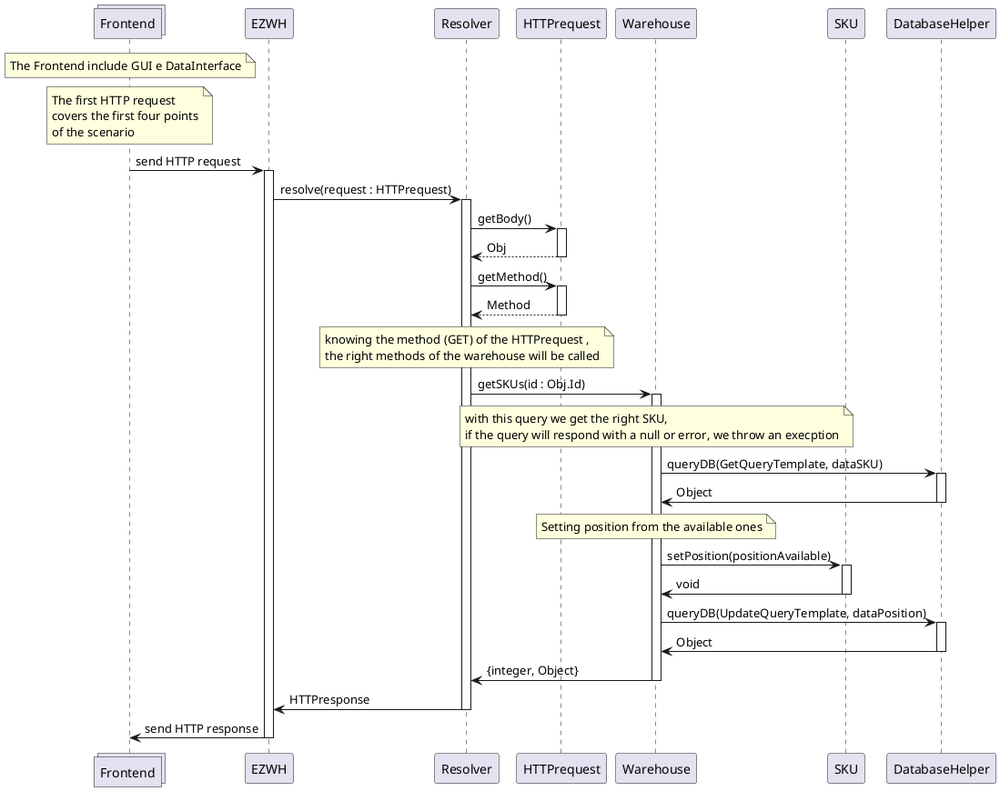
# Sequence Diagram 2-1 : Create position
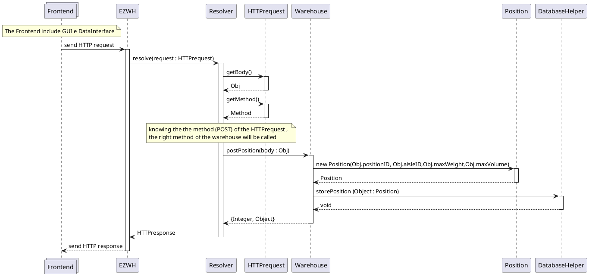
# Sequence Diagram 3-2 : Restock Order of SKU S issued by supplier
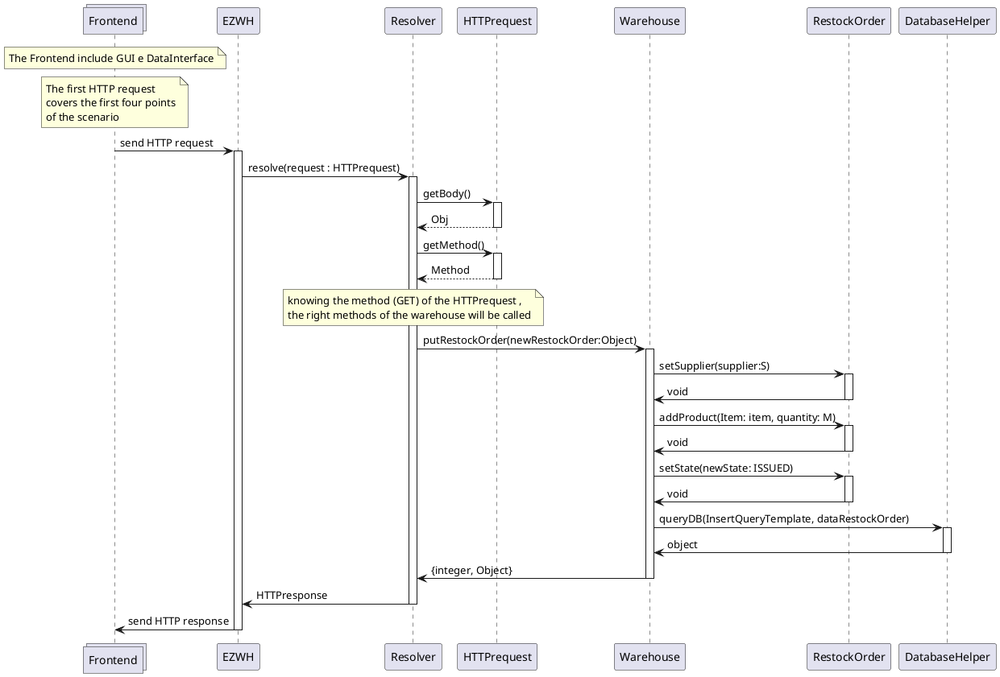
# Sequence Diagram 5-1-1 : Record restock order arrival
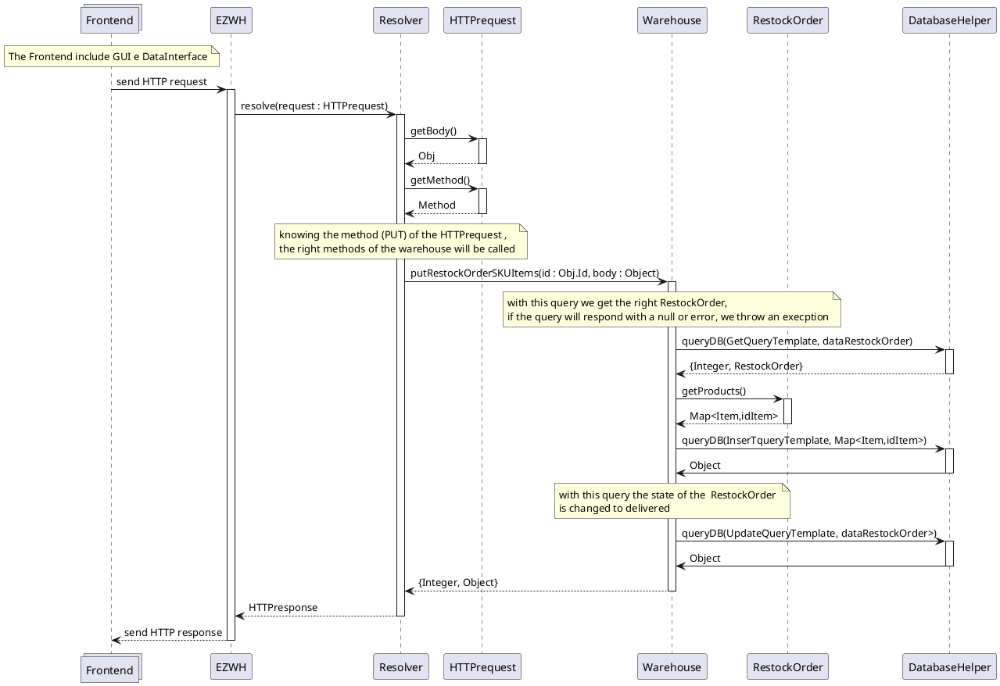
# Sequence Diagram 5-2-3 : Record negative and positive test results of all SKU items of a RestockOrder
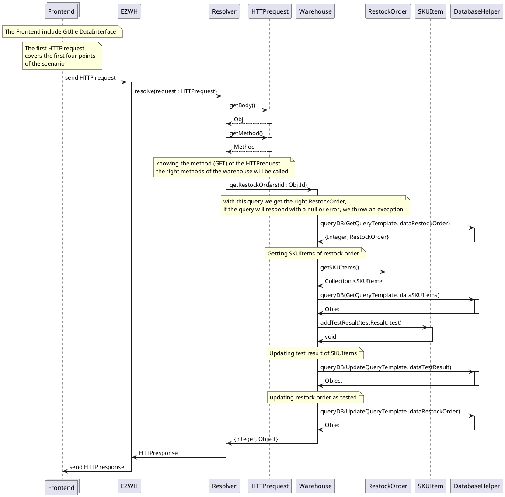
# Sequence Diagram 5-3-3 : Stock some SKU items of a RO
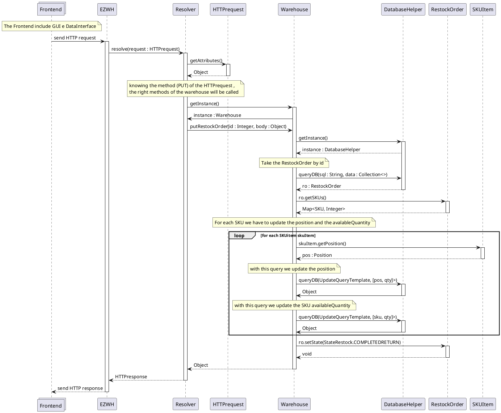
# Sequence Diagram 6-2 : Return order of any SKU items
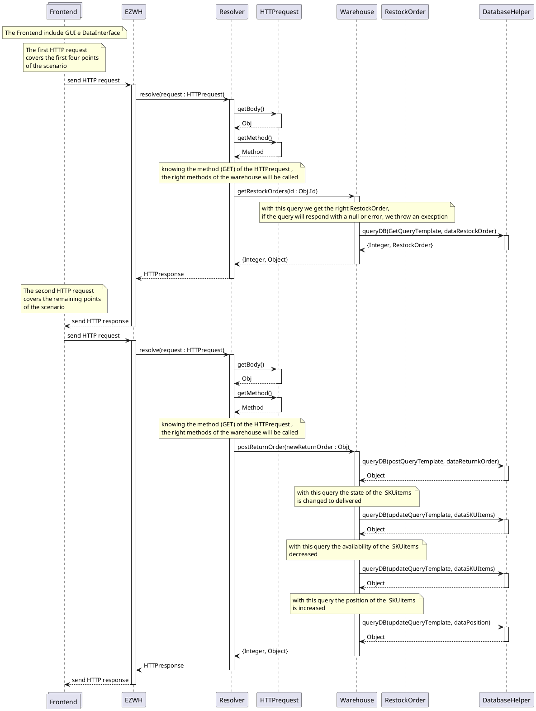
# Sequence Diagram 9-1 : Internal Order IO accepted
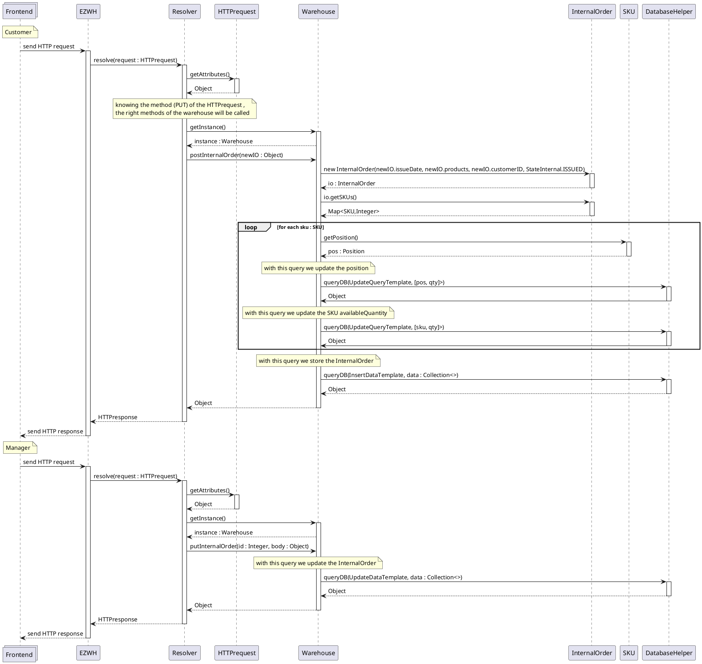
# Sequence Diagram 10-1 : Internal Order IO Completed
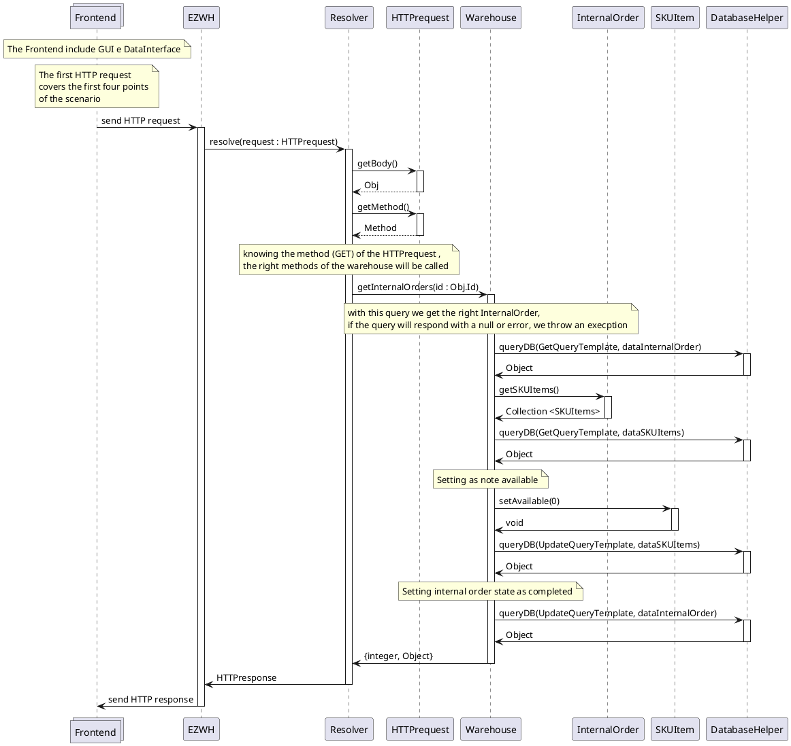
# Sequence Diagram 11-1 : Create Item I
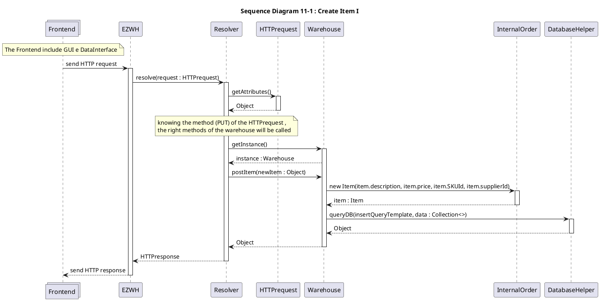
# Sequence Diagram 12-1 : Create test description
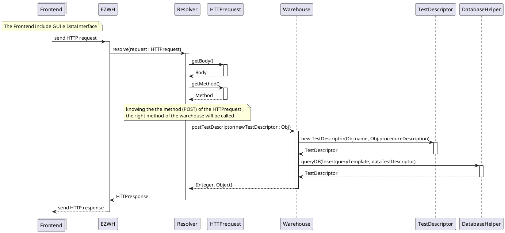

 The method queryDB(sql:String, data : Collection<>) is composed by a string (sql), which is a template query that is filled with the parameter contained in the collection (data).
 The method return an Object that could be contain the requested values or an error.

 example:

 sql = "SELECT ? FROM ?"  
 data = [*, POSITION] 
 query = "SELECT * FROM POSITION" 