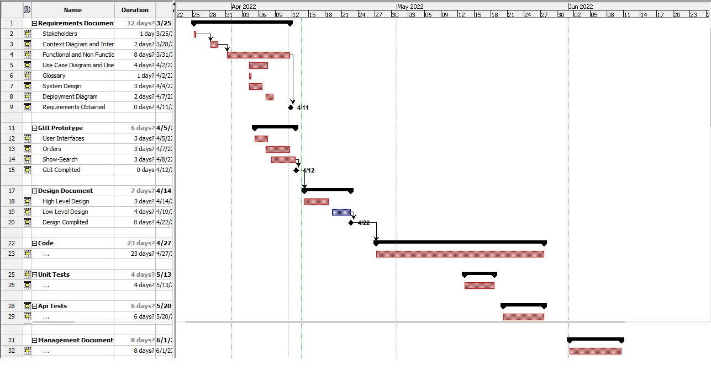

# Project Estimation  
Date: 2022-04-12

Version: 1.0.1

| Version number | Change |
| ----------------- |:-----------|
| 0.1.0 | Estimate by size | 
| 0.2.0 | Estimate by decomposition |
| 1.0.0 | Estimate by activity decomposition and Gantt Chart|

# Estimation approach
Consider the EZWH  project as described in YOUR requirement document, assume that you are going to develop the project INDEPENDENT of the deadlines of the course
# Estimate by size
### 
|             | Estimate                        |             
| ----------- | ------------------------------- |  
| NC =  Estimated number of classes to be developed   | 25 |             
|  A = Estimated average size per class, in LOC       | 150 | 
| S = Estimated size of project, in LOC (= NC * A) | 3750 LOC |
| E = Estimated effort, in person hours (here use productivity 10 LOC per person hour)  | 3750/10 = 375 person hours |   
| C = Estimated cost, in euro (here use 1 person hour cost = 30 euro) | 375*30 = 11250 euro | 
| Estimated calendar time, in calendar weeks (Assume team of 4 people, 8 hours per day, 5 days per week ) | 375/(8\*4\*5) = 2.5 weeks |               

# Estimate by product decomposition
### 
|         component name    | Estimated effort (person hours)   |             
| ----------- | ------------------------------- | 
|requirement document    | 40 |
| GUI prototype | 20 |
|design document | 50 |
|code | 3750/10=375 |
| unit tests | (250 LOC/CLASS)*(10 CLASS)/(10 LOC/PERSON HOURS) = 250 |
| api tests | 30 |
| management documents  | 20 |
|||
| total | 775 | 

# Estimate by activity decomposition
### 
|         Activity name  |  | Estimated effort (person hours)   |             
| -----------|- | ------------------------------- | 
|Requirements||168|
| | Stakeholders | 8 |
||Context Diagram and Interfaces |16|
||Functional and non Functional requirements |64|
||Use case Diagram and Use Cases|32|
||Glossary|8|
||System Design |24|
||Deployment Diagram|16|
||||
|GUI Prototype||48|
||User Intefaces|8|
||Orders |20|
||Show-Search|20|
||||
|Design Document ||168|
||Low Level Design|96|
||High Level Design|72|
||||
|Code ||512+56=568|
||||
|Unit Tests||128|
||||
|API Tests||48|
||||
|Management Document||64|
### Gantt Chart

# Summary

|             | Estimated effort                        |   Estimated duration |          
| ----------- | ------------------------------- | ---------------|
| estimate by size | 375 | 2.5 weeks | 
| estimate by product decomposition | 775 | 775/(8\*4\*5) = 4.8 weeks |
| estimate by activity decomposition |1192|11 weeks|

1) The estimation by size take only in account the size of the code, it could be similar to the part of "Code" activity that was calculated in the gantt chart
2) The estimation by product decomposition doesn't take in account the sub activities for determining the product and the parallelizing of the work on them
3) The estimation by activity decomposition is the more accurate between these,it take in account the parallelizing of the activities among the team memebers, some activity can depend from others and there may be a milestone.
