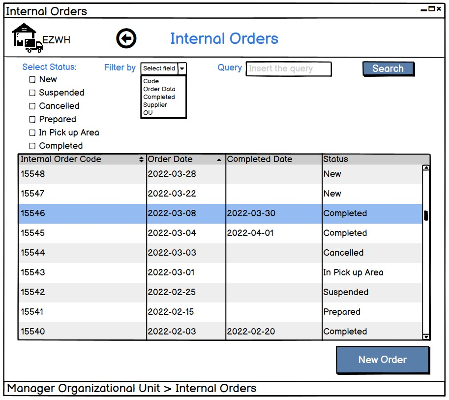
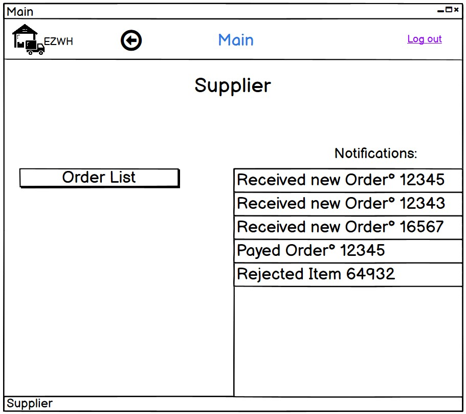
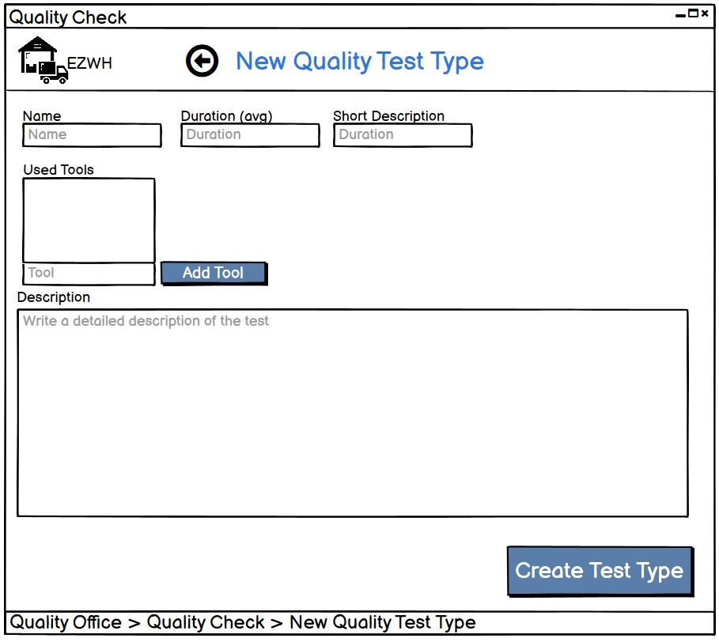

# Graphical User Interface Prototype  

Authors: Michele Cerra, Francesco Dall'Agata, Cihan Yurtsever, Matteo Panigati 

Date: 2022-04-06

Version: 1.1.1

| Version number | Change |
| ----------------- |:-----------|
| 0.1.0 | Log in |
| 0.2.0 | User List |
| 0.2.1 | Create User, Show User |
| 0.3.0 | Search Item |
| 0.3.1 | Define new Item, Show Item |
| 0.4.0 | Show Hiysory Orders, New order|
| 0.4.1 | Show order |
| 0.4.2 | Orders, side Supplier |
| 0.5.0 | Main page of users |
| 0.6.0 | Internal Orders and Quality check section |
| 1.0.0 | GUI EZWH |
| 1.1.0 | Test Type and minor updates |

# Manage Item
## Define new Item
### Manager Warehouse

## Delete and/or Modify Item fields
### Manager Warehouse

## Show Item fields
### Worker

# Search for items
### Manager Warehouse

### Worker

# Manage Orders
## Show history orders
### Manager Warehouse

### Supplier

## Order a new item
### Manager Warehouse

## Checking the order state
### Manager Warehouse

### Supplier

# Manage internal orders
## Show history orders
### Manager warehouse

### Manager OU

## Order a new item
### Manager OU

## Checking the internal order state
### Manager warehouse

### Manager OU

# Manage users
## Create user and define rights
### Manager Company

## Modify and/or delete user
### Manager Company

## Show user list
### Manager Company

# Manage suppliers
## Create supplier and define rights
### Manager warehouse

## Modify and/or delete supplier
### Manager warehouse

## Show supplier list
### Manager warehouse

# Authenticate, authorize
## Login

## Fail Log in

# Notify system and Main pages
### Manager Company

### Manager Warehouse

### Worker

### Supplier

### Quality office

### Manager OU

# Quality Office
## Quality check
### Manager Quality Office

## Create test type
### Manager Quality Office

## Show/Modify/Delete test type
### Manager Quality Office

