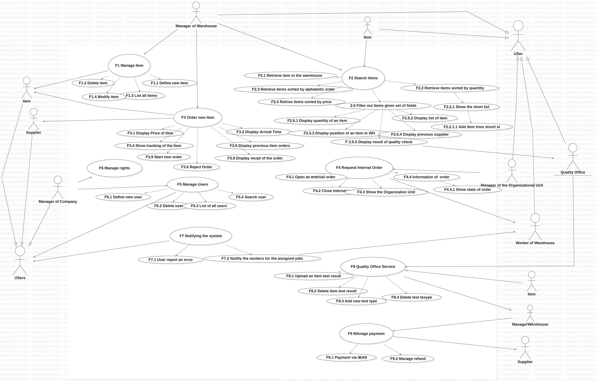
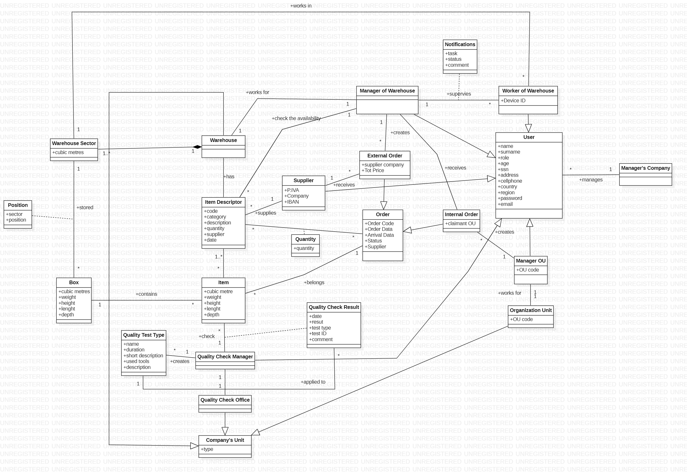
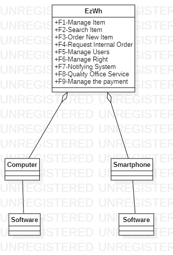
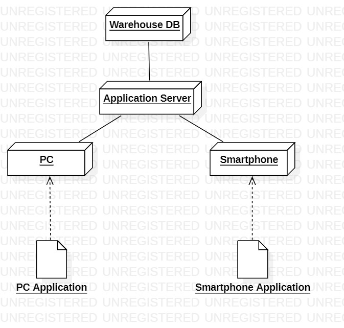

#Requirements Document 

Date: 2022-04-06

Version: 1.1.0

 
| Version number | Change |
| ----------------- |:-----------|
| 0.1.0 | Stakeholders|
| 0.2.0 | Interfaces and Actors |
| 0.2.1 | Minor updates |
| 0.3.0 | Functional Requirements |
| 0.4.0 | Context Diagram |
| 0.4.1 | Update Functional Requirements|
| 0.5.0 | Unfunctional Requirements |
| 0.5.1 | minor updates |
| 0.6.0 | Personas and Stories |
| 0.6.1 | Update Functional and Unfunctional requirements |
| 0.7.0 | Access Rights |
| 0.8.0 | Use Cases |
| 0.9.0 | GUI |
| 0.10.0| Deployment Diagram|
| 0.11.0 | System Design |
| 0.12.0 | Glossary |
| 1.0.0 | General Check |

# Contents	
- [Contents](#contents)
- [Informal description](#informal-description)
- [Stakeholders](#stakeholders)
- [Context Diagram and interfaces](#context-diagram-and-interfaces)
	- [Context Diagram](#context-diagram)
	- [Actors](#actors)
	- [Interfaces](#interfaces)
- [Stories and personas](#stories-and-personas)
	- [Manager of Warehouse](#manager-of-warehouse)
		- [Persona 1](#persona-1)
		- [Persona 2](#persona-2)
	- [Quality Office Worker](#quality-office-worker)
		- [Persona 1](#persona-1-1)
	- [Worker of Warehouse](#worker-of-warehouse)
		- [Persona 1](#persona-1-2)
		- [Persona 2](#persona-2-1)
	- [Suppliers representator](#suppliers-representator)
		- [Persona 1](#persona-1-3)
	- [Manager of other organizational unit](#manager-of-other-organizational-unit)
		- [Persona 1](#persona-1-4)
- [Functional and non functional requirements](#functional-and-non-functional-requirements)
	- [Functional Requirements](#functional-requirements)
		- [Access right, actor vs function](#access-right-actor-vs-function)
	- [Non Functional Requirements](#non-functional-requirements)
- [Use case diagram and use cases](#use-case-diagram-and-use-cases)
	- [Use case diagram](#use-case-diagram)
	- [Use case 1, UC1 - Manage item](#use-case-1-uc1---manage-item)
		- [Scenario 1-1](#scenario-1-1)
		- [Scenario 1-2](#scenario-1-2)
		- [Scenario 1-3](#scenario-1-3)
		- [Scenario 1-4](#scenario-1-4)
		- [Scenario 1-5](#scenario-1-5)
		- [Scenario 1-6](#scenario-1-6)
	- [Use Case 2, UC2 - Search for items](#use-case-2-uc2---search-for-items)
		- [Scenario 2-1](#scenario-2-1)
		- [Scenario 2-2](#scenario-2-2)
		- [Scenario 2-3](#scenario-2-3)
		- [Scenario 2-4](#scenario-2-4)
	- [Use case 3, UC3 - Orders management](#use-case-3-uc3---orders-management)
		- [Scenario 3-1](#scenario-3-1)
		- [Scenario 3-2](#scenario-3-2)
		- [Scenario 3-3](#scenario-3-3)
	- [Use case 4, UC4 - Internal order](#use-case-4-uc4---internal-order)
		- [Scenario 4-1](#scenario-4-1)
		- [Scenario 4-2](#scenario-4-2)
	- [Use case 5, UC5 - Manage users](#use-case-5-uc5---manage-users)
		- [Scenario 5-1](#scenario-5-1)
		- [Scenario 5-2](#scenario-5-2)
		- [Scenario 5-3](#scenario-5-3)
		- [Scenario 5-4](#scenario-5-4)
		- [Scenario 5-5](#scenario-5-5)
		- [Scenario 5-6](#scenario-5-6)
		- [Scenario 5-7](#scenario-5-7)
	- [Use case 6, UC6 - Manage suppliers](#use-case-6-uc6---manage-suppliers)
		- [Scenario 6-1](#scenario-6-1)
		- [Scenario 6-2](#scenario-6-2)
		- [Scenario 6-3](#scenario-6-3)
		- [Scenario 6-4](#scenario-6-4)
		- [Scenario 6-5](#scenario-6-5)
		- [Scenario 6-6](#scenario-6-6)
		- [Scenario 6-7](#scenario-6-7)
	- [Use case 7, UC7 - Authenticate, authorize](#use-case-7-uc7---authenticate-authorize)
		- [Scenario 7-1](#scenario-7-1)
		- [Scenario 7-2](#scenario-7-2)
		- [Scenario 7-3](#scenario-7-3)
		- [Scenario 7-4](#scenario-7-4)
	- [Use Case 8, UC8 - Notifying system](#use-case-8-uc8---notifying-system)
		- [Scenario 8-1](#scenario-8-1)
		- [Scenario 8-2](#scenario-8-2)
		- [Scenario 8-3](#scenario-8-3)
	- [Use Case 9, UC9 - Quality office service](#use-case-9-uc9---quality-office-service)
		- [Scenario 9-1](#scenario-9-1)
		- [Scenario 9-2](#scenario-9-2)
		- [Scenario 9-3](#scenario-9-3)
		- [Scenario 9-4](#scenario-9-4)
	- [Use Case 10, UC10 - Manage Payment](#use-case-10-uc10---manage-payment)
		- [Scenario 10-1](#scenario-10-1)
		- [Scenario 10-2](#scenario-10-2)
		- [Scenario 10-3](#scenario-10-3)
- [Glossary](#glossary)
- [System Design](#system-design)
- [Deployment Diagram](#deployment-diagram)

# Informal description
Medium companies and retailers need a simple application to manage the relationship with suppliers and the inventory of physical items stocked in a physical warehouse. 
The warehouse is supervised by a manager, who supervises the availability of items. When a certain item is in short supply, the manager issues an order to a supplier. In general the same item can be purchased by many suppliers. The warehouse keeps a list of possible suppliers per item. 

After some time the items ordered to a supplier are received. The items must be quality checked and stored in specific positions in the warehouse. The quality check is performed by specific roles (quality office), who apply specific tests for item (different items are tested differently). Possibly the tests are not made at all, or made randomly on some of the items received. If an item does not pass a quality test it may be rejected and sent back to the supplier. 

Storage of items in the warehouse must take into account the availability of physical space in the warehouse. Further the position of items must be traced to guide later recollection of them.

The warehouse is part of a company. Other organizational units (OU) of the company may ask for items in the warehouse. This is implemented via internal orders, received by the warehouse. Upon reception of an internal order the warehouse must collect the requested item(s), prepare them and deliver them to a pick up area. When the item is collected by the other OU the internal order is completed. 

EZWH (EaSy WareHouse) is a software application to support the management of a warehouse.

# Stakeholders
| Stakeholder name  | Description | 
| ----------------- |:-----------:|
|   Companies   |  Medium company that buy and sell products  | 
| 	Retailers | Buy and sell products |
| 	Suppliers | Who give us the products |
| 	Manager of Company | Who manage the company |
| 	Manager of Warehouse | who supervises the availability of items in the warehouse |
|   Worker of Warehouse | Who work in the physical warehouse |
|	Quality Office | who apply specific tests for item |
|	Organizational Units | Other offices like marketing office |
|	Delivery company | Who deliver the requested items |
| 	Markets (price) | the entity who decide the price of an item |
| 	Warehouse | Where are stored the items |
|	Software Application Competitor | Other Software application producer |
| 	Payment Service | Money transfer system |
|	Database System | Database in which the data are saved |

# Context Diagram and interfaces

## Context Diagram

## Actors
| Actor |
|-|
| Manager of Company |
| Manager of Warehouse |
| Worker of Warehouse |
| Suppliers reppresentator |
| Manager of Quality office |
| Manager of the Organizational units | 
| Payment Service |

## Interfaces
| Interface  | Description | 
| ----------------- |:-----------:|
| GUI of EZWH Software| It is a graphical interface for managing the warehouse, each Actor have different permissions |
| Payment API | Refers to API document |
| Database API | Refers to API document |

| Actor | Logical Interface | Physical Interface  |
| ------------- |:-------------:| -----:|
|   Manager of Company | GUI of EZWH Software|  Screen Keyboard on Computer |
|   Manager of Warehouse| GUI of EZWH Software|  Screen Keyboard on Computer |
| 	Worker of Warehouse| GUI of EZWH Software | touchscreen on mobile device |
|	Suppliers representator | GUI of EZWH Software | Screen Keyboard of Computer |
| 	Manager of Quality office | GUI of EZWH Software | Screen Keyboard on Computer |
| 	Manager of the Organizational units | GUI of EZWH Software | Screen Keyboard on Computer |
|  	Payment Service | API description | Internet Connection |
| 	Database System | API description | Server |

# Stories and personas

## Manager of Warehouse

### Persona 1
Anna is 50, she is the chief manager of a medium company. The company delivers different products to people around world. Depending on the sales, from her computer, Anna decides to change, develop or add new members, and items to the company. So, Anna always should be sure of the functionalities of the department and the strategy of the company.   She needs an application that allows her to follow and visulize the warehouse and other units.
### Persona 2
Marco is 36, he is a member of the medium(or retailer) company which has a big warehouse, which is managed by him. Usually, he works with his computer in the office. From his computers, he manages the affairs with suppliers and workers. Additionally, he also checks the item stocks. When the item is in the short supply, he makes offers to suppliers. To check and visualize  all those activities he needs an application that facilitates managing his affair and warehouse duties.
## Quality Office Worker
### Persona 1
Sergio is 35, he is a test manager who arranges the test units, and depending on the test results he informs the warehouse manager. Due to workload, sometimes he forgets to confirm the test and send the results to the warehouse manager(who decides to reject or accept the item). He needs an application that stores the test results and sends those to inform the warehouse manager. 
## Worker of Warehouse
### Persona 1
Cristina is 25, and she is a new warehousewoman who completes the tasks assigned to her. Usually, she is asked to put items in specific places. Although she doesn't know the place of the items in the warehouse, she needs an application that all directives are written for the information about an item and the location in the warehouse and see the task that assigned to her.
### Persona 2
Giovanni is 55, he is an old man. When the other units of the company want some specific item he is corresponding to carry them to the specified location. So, he needs and mobile device to see the Other Unit item requests. However, he doesn't know how to use mobile devices, he needs a simple GUI in which are presents all the items to do.

## Suppliers representator
### Persona 1
Rebecca is 35, works as a supplier and for this reason, she has to visit different customers every day. So she has limited time to make offers to companies. To communicate with more users and directly negotiate with the companies, she would like to have a single platform in which she can receive all the orders and make offers to companies.

## Manager of other organizational unit
### Persona 1
Antonio is 47, is an administrator of repair shop of a big company that have also a separate warehouse 10km far, using e-mails and calls are inefficient, they can lead to misunderstandings and errors. For this is looking for an application in which he can comunicate and make an internal order with the warehouse manager without many efforts.

# Functional and non functional requirements

## Functional Requirements

| ID        | Description  |
| ------------- |:-------------:| 
|  FR1 | Manage Item |
|  FR1.1 | Define new Item|
|  FR1.2 | Delete Item |
|  FR1.3 | List all items |
|  FR1.4 | Modify an existing one |
|  FR1.5 | Modify Box dimensions |
|  FR1.6 | Find new free box |
|||
|  FR2 | Search items |
|  FR2.1 | Retrieve items in the warehouse  |
|  FR2.2 | Retrieve items sorted by quantity (availability) |
|  FR2.2.1 | Show the short list |
|  FR2.2.1.1 | Add Item short list |
|  FR2.2.1.2 | Remove Item short list |
|  FR2.2.1.3 | Order Items in the short list |
|  FR2.3 | Retrieve items sorted by alfabetich order |
|  FR2.4 | Retrieve items sorted by price order |
|  FR2.5 | Filter out item by given set of fields |
|  FR2.6 | Display information of an item |
|  FR2.6.1 | Display quantity of an item (it could be 0) |
|  FR2.6.2 | Display supplier list of a item |
|  FR2.6.3 | Display the position of the item in the warehouse|
|  FR2.6.4 | Display the previous suppliers |
|  FR2.6.5 | Display the results of the quality check |
|  FR2.6.6 | Display the availability of physical space in that position in the warehouse |
|||
| FR3 | Manage Orders |
| FR3.1 | Display the price of the item |
| FR3.2 | Display the arrival time |
| FR3.3 | Show the tracking of a item |
| FR3.4 | Display previuos item orders |
| FR3.5 | Display order summary|
| FR3.6 | Display recipts of the order|
| FR3.7 | Display the shipping company|
| FR3.8 | Start a new Order|
| FR3.9 | Cancel an Order |
| FR3.10 | Reject an order |
| FR3.11 | Suspend an order |
| FR3.12 | Modify an order |
| FR3.13 | Accept an order |
|||
| FR4 | Request an internal order |
| FR4.1 | Open internal order  |
| FR4.2 | Close internal order |
| FR4.3 | Show the Organization Unit who asked the item |
| FR4.4 | Show the informations about the internal order |
| FR4.4.1 | Show the state of the order |
|||
|  FR5 |  Manage users|
|  FR5.1 | Define a new user, or modify an existing user |
|  FR5.2 | Delete a user |
|  FR5.3 |    List all users   |
|  FR5.4 |    Search a user   |
|||
|  FR6 |  Manage rights. Authorize access to functions to specific actors according to access rights|
|||
|FR7|Notifying system inside the software|
|FR7.1| Provide a function for the user to report errors|
|FR7.2| Provide infomation about the work of the warehouse between workers |
|FR7.3| Notifying forgot password |
|FR7.4| Provide infomation when shipping arrived |
|||
|FR8|Quality Office Service|
|FR8.1|Upload test result|
|FR8.2|Delete test result|
|FR8.3|Add new test type|
|FR8.4|Delete test type|
|||
|FR9| Manage the payments|
|FR9.1|Payment via IBAN|
|FR9.1|Manage a refound|

### Access right, actor vs function

| Function |  Manager Company| Manager Warehouse | Worker of warehouse | Supplier | Quality Office | Manager OU |
| -------------|- |:-------------|--|--| - | -|
| FR1 |no| yes | no | no | no | no |
| FR2 |no| yes | yes | no | no | yes |
| FR3 |no| yes | no | yes | no | no |
| FR4 |no| yes | no | no | no | yes |
| FR5 | yes | no | no | no | no | no |
| FR6 |no| yes | no | no | no | no |
| FR7 |yes | yes | no | no | no | no |
| FR8 |no| yes | yes | yes | no | yes |
| FR9 |no| no | no | no | yes | no |
| FR10 | no | yes | no | no | no |no|

## Non Functional Requirements

| ID        | Type (efficiency, reliability, ..)           | Description  | Refers to FR |
| ------------- |:-------------:| :-----:| -----:|
|  NFR1     | Reliability | The lack of data is less than 0.1% of requests  | All FR |
|  NFR3     | Reliability | Massimum Faults in the server are 1 per week  | All FR |
|  NFR4		| Availability | The Service must be accessible at the least in the working hours (7:00 a.m. - 7:00 p.m.) |All FR  |
|  NFR5     | Maintainability | Time to fix reported errors less than 1 day | All FR |
|  NFR6     | Security | Guarantee protection of data (always) | All FR|
|  NFR7     | Safety | Avoid collision between different orders (The software schedules the orders every 1ms in order to avoid collisions), so define how the system manages contemporary transactions on the same order |FR3,FR4|
|  NFR8     | Performance | Time required to update information provided to the user is less than 2sec |All FR |
|  NFR9     | Performance | Define maximun workload of the system (We have added the efficieny (RAM and Disk)) |All FR |
|  NFR10    | Usability | Time required for a user to get comfortable with the software is 1 day | All FR |
|  NFR11    | Backup | Recover information in case of critical failure is made in less than 1 day |All FR |
|  NFR12	| Efficiency | Response time less than 0.5s for all functions | All FR |
|  NFR13 	| Efficiency | RAM usage less than 16GB and Disk usage less than 100GB |All FR |

# Use case diagram and use cases

## Use case diagram

## Use case 1, UC1 - Manage item
| Actors Involved        | Manager Warehouse |
| ------------- |:-------------:|
|  Precondition | Manager Warehouse M exists and is logged In |
|  Post condition |  |
|  Nominal Scenario |  M creates a new item I populating its fields  |
|  Variants     | I exists already, M modifies its fields  |
| | I is assigned to a full location, issue warning |
| | I is assigned to an existing code , issue warning |

### Scenario 1-1
| Scenario |  Define new Item |
| ------------- |:-------------:| 
|  Precondition     | Manager Warehouse M exists and is logged in |
|  Post condition     | Item I into the system  |
| Step#        | Description  |
|  1    |  M inserts new product description |  
|  2 	|  M inserts new code |
|  3 	|  M inserts the category between A,B,C |
|  4 	|  M inserts the quantity |
|  5    |  M inserts new weight and dimension |
|  6    |  M inserts suppliers |
|  7    |  M inserts the sector of warehouse |
|  8    |  M inserts the position in the sector |
|  9    |  M confirms the entered data |

### Scenario 1-2
| Scenario |  Delete Item fields |
| ------------- |:-------------:| 
|  Precondition     | Manager Warehouse M exists and is logged in |
|  | Item I exists |
|  Post condition     | Item I is deleted |
| Step#        | Description  |
|  1    |  M select item I |
|  2    |  M deletes some fields of I |
|  3	|  History of items and ID of items are updated |
|  4    |  M confirms the changes |

### Scenario 1-3
| Scenario |  Modify Item fields |
| ------------- |:-------------:| 
|  Precondition     | Manager Warehouse M exists and is logged in |
|  | Item I exists |
|  Post condition     | Item I is modified |
| Step#        | Description  |
|  1    |  M select item I |
|  2    |  M modify some fields of I |
|  3	|  History of prices and list of suppliers are automatically updated |
|  4    |  M confirms the entered data |

### Scenario 1-4
| Scenario |  Fail modify Item fields |
| ------------- |:-------------:| 
|  Precondition     | Manager Warehouse M exists and is logged in |
|  | Item I exists |
|  Post condition     | Item I is not modified |
| Step#        | Description  |
|  1    |  M select item I |
|  2    |  M modify some fields of I |
|	3	| A forgot some mandatory fields : code, description, category, quantity, list of suppliers, position on warehouse |
|	3*	| A write in uncorrect format some field |
|  4    |  M confirms the entered data |
| 5  	| Software shows an error |

### Scenario 1-5
| Scenario |  Delete an Item |
| ------------- |:-------------:| 
|  Precondition     | Manager Warehouse M exists and is logged in |
|  | Item I exists |
|  Post condition     | Item I is deleted |
| Step#        | Description  |
|  1    |  M select item I |
|  2    |  M delete the item |
|	3	| M wrote correctly his password |
|	4	| I is deleted |

### Scenario 1-6
| Scenario |  Find free box |
| ------------- |:-------------:| 
|  Precondition     | Manager Warehouse M exists and is logged in |
|  | Item I exists |
|	| The Box B of item I is full |
|	| Manager Warehouse W want move the items in a new position |
|  Post condition     | Item I change postion or sector |
| | A notification is sent to a worker |
| Step#        | Description  |
|  1    |  M select item I |
|  2    |  M find a free box |
|	3	| Free box is searched among all the boxes that are empty and the tot space is > of the curr space of the box of the selected item |
|	4	| A new box B is founded|
|	5	| The item I is moved |

## Use Case 2, UC2 - Search for items
| Actors Involved        | Manager Warehouse, workers |
| ------------- |:-------------:| 
|  Precondition     | Some particolar items are stored in the warehouse |
|  Post condition     | The user gets the desiderd information about the product |
|  Nominal Scenario     | The user selects keywords or category in order to find the products |
|  Variants     | Items are not found|
|  Exceptions     | |

### Scenario 2-1 
| Scenario |Search done by the user|
| ------------- |:-------------:| 
|  Precondition     | The user needs searching for a specific item |
|  Post condition     | The user find the searched item |
| Step#        | Description  |
|  1     | Keywords related to the item name are inserted in the search engine  |  
|  2     | Database search is performed |
|  3     | Specific items are showed |

### Scenario 2-2
| Scenario 2.2 | Sorted items list |
| ------------- |:-------------:| 
|  Precondition     | Information about the items are stored|
|  Post condition     | The user get a sorted list of the items |
| Step#        | Description  |
|  1     | item property is selected |  
|  2     | Database filtered search is performed |
|  3     | Specific items are showed |

### Scenario 2-3
| Scenario 2.3 | Short list view |
| ------------- |:-------------:| 
|  Precondition     | Short list exists |
|  Post condition     | The manager get the items of the short list |
| Step#        | Description  |
|  1 	 | The threshold quantity is selected |
|  2     | Short list is requested |  
|  3     | Short list is showed |

### Scenario 2-4
| Scenario 2.4 | Position information for the workers |
| ------------- |:-------------:| 
|  Precondition     | The worker is needed to operate in the warehouse |
|  Post condition     | The workers performs its job |
| Step#        | Description  |
|  1     | Item I requests an operation from the worker |  
|  2     | Location of the item is loaded |
|  3     | Location is showed to the worker |
|  4     | warehouse change is updated |

## Use case 3, UC3 - Orders management
| Actors Involved        | Manager of the warehouse, supplier |
| ------------- |:-------------:|
|  Precondition | The manager of warehouse wants to make an order |
|  Post condition | The manager of warehouse successfully purchase an item |
|  Nominal Scenario |  The manager of warehouse select an item to complete the transaction  |
|  Variants     |  |
|  Exceptions 	| Unsuccessful order transaction |

### Scenario 3-1
| Scenario |  Order an item from a supplier |
| ------------- |:-------------:| 
|  Precondition     | The manager of the warehouse wants to make an order |
|  Post condition   | The order is purchased |
| Step#        | Description  |
|	1	| The list of the previous order from all the suppliers is prompted |
|	2	| "New order is selected" |
|	3	| A supplier is selected from the list of all suppliers |
|	4	| The items that can be ordered from the specific supplier are shown |
|	5	| The form for ordering a product never bought before is shown |
|	6	| One or more previously purchased items are shown or new item information are inserted |
|	7	| The order is sent to the supplier |
|	8	| The order page is created |
|	9	| Any modification sent from the supplier is showed and can be accepted with "Accept the changes"|
|	10	| The order is payed |

### Scenario 3-2
| Scenario |  Accept a new order from the warehouse |
| ------------- |:-------------:| 
|  Precondition     | The supplier receives an order from the warehouse |
|  Post condition   | The supplier accepts the order |
| Step#        | Description  |
|	1	| The list of previous orders and new pending orders is prompted |
|	2	| A new order is selected |
|	3	| All the items requested from the warehouse are shown with all details |
|	4	| The supplier changes price and amount of an item if needed |
|	5	| The supplier suspend or delete the order if needed |
|	6	| If there are changes about the order they are sent back to the warehouse |
|	7	| The supplier accept the order |

### Scenario 3-3
| Scenario |  Checking order state |
| ------------- |:-------------:| 
|  Precondition     | One or more ordered were previuosly confirmed |
|  Post condition   | The user gets information about the selected order |
| Step#        | Description  |
|	1	| The user gets a list of its previous order |
|	2	| The user select an element from the list |
|	3	| Arrival time is displayed if available |
|	4	| Tracking of the item is displayed if available |
|	5	| Rejection procedure is displayed if possible |
|	6	| Order receipt is displayed if available |

## Use case 4, UC4 - Internal order
| Actors Involved        | Manager of the warehouse, manager of the organizational unit |
| ------------- |:-------------:|
|  Precondition | An organizational unit start an internal order |
|  Post condition | The order is completed|
|  Nominal Scenario |  The organizational unit send data about the order to the manager of the warehouse  |
|  Variants     | The order is suspended or declined |
|  Exceptions 	| |

### Scenario 4-1
| Scenario |  Manager of the warehouse receives an order |
| ------------- |:-------------:| 
|  Precondition     | Manager of the warehouse receives an internal order |
|  Post condition     | The order is accepted |
| Step#        | Description  |
|	1	| Manager of the warehouse views the list of new and previous internal order |
|	2	| Manager selects a new order|
|	3	| Order details and item list are displayed |
|	4	| The order can be edited, deleted or suspended |
|	5	| The order is accepted |

### Scenario 4-2
| Scenario |  Organizational unit sends an order |
| ------------- |:-------------:| 
|  Precondition     | Manager of the organizational unit starts a new internal order |
|  Post condition     | The order is sent to the manager of the warehouse |
| Step#        | Description  |
|	1	| Manager of the organizational unit views the list of previous and new internal order |
|	2	| Manger selects new order |
|	3	| List or filtered list of previously ordered items is displayed |
|	4	| Desired items are selected and added to the items to order list |
|	5	| Complete order details are displayed |
|	6	| Changes from the manager of the warehouse about the order can be accepted |
|	7	| The order is accepted |

## Use case 5, UC5 - Manage users
| Actors Involved        | Manager Company |
| ------------- |:-------------:|
|  Precondition | Manager Company M logged in |
|  Post condition |  |
|  Nominal Scenario |  M defines a new user and its access rights  |
|  Variants     | M modifies fields or access rights of an existing user |
| | M delete a user |
|  Exceptions 	| M modifies with a wrong format or forgot some mandatory fields |
| | M tipe a wrong password for deleting a user |

### Scenario 5-1
| Scenario |  Create user and define rights |
| ------------- |:-------------:| 
|  Precondition     | Manager Company M exists and is logged in |
| | User U does not exist |
|  Post condition     | User U added in the system |
| Step#        | Description  |
|	1	| M define the credentials of the new user U |
|	2	| M selects the access rights (Manager Warehouse, Worker of warehouse, Supplier, Quality Office, Manager OU) |
|	3	| M confirms the inserted data |

### Scenario 5-2
| Scenario |  Fail to create a user |
| ------------- |:-------------:| 
|  Precondition     | Manager Company M exists and is logged in |
| | User U does not exist |
|  Post condition     | User U not added in the system |
| Step#        | Description  |
|	1	| M define the credentials of the new user U |
|	2	| M selects the access rights (Manager Warehouse, Worker of warehouse, Supplier, Quality Office, Manager OU) |
|	3	| M forgot some mandatory fields : Name, Surname, SSN, Email, Confirm Email, Password, Confirm Password, Role, BirthDay, Company Name (name of Supplier company if Supplier) |
|	3*	| M write in uncorrect format some field |
|	4	| M confirms the inserted data |

### Scenario 5-3
| Scenario |  Modify a user |
| ------------- |:-------------:| 
|  Precondition     | Manager Company M exists and is logged in |
| | User U exists |
|  Post condition     | User U modified |
| Step#        | Description  |
|	1	| M select user U |
|	2	| M modify the credentials of the user U |
|	3	| M confirms the inserted data |

### Scenario 5-4
| Scenario |  Fail modify a user |
| ------------- |:-------------:| 
|  Precondition     | Manager Company M exists and is logged in |
| | User U exists |
|  Post condition     | User U not modified |
| Step#        | Description  |
|	1	| M select user U |
|	2	| M modify the credentials of the user U |
|	3	| M remove some mandatory fields and don't add new ones: Name, Surname, SSN, Email, Confirm Email, Password, Confirm Password, Role, BirthDay, Company Name (name of Supplier company if Supplier) |
|	3*	| M write in uncorrect format some field |
|	4	| M confirms the inserted data |

### Scenario 5-5
| Scenario |  Delete user |
| ------------- |:-------------:| 
|  Precondition     | Manager Company M exists and is logged in |
|  | User U exists |
|  Post condition     | User U deleted |
| Step#        | Description  |
|  1    |  M selects user U  |
|	2	|  M delete the user U |
|	3	|  M insert the a password for deleting the user |
|  4    |  U deleted from the system |

### Scenario 5-6
| Scenario |  Fail deleting user |
| ------------- |:-------------:| 
|  Precondition     | Manager Company M exists and is logged in |
|  | User U exists |
|  Post condition     | User U is not deleted |
| Step#        | Description  |
|  1    |  M selects user U  |
|	2	|  M delete the user U |
|	3	|  M insert the a wrong password for deleting the user |
|  4    |  M tries to delete the U |

### Scenario 5-7
| Scenario |  Show user list |
| ------------- |:-------------:| 
|  Precondition     | Manager Company M exists and is logged in |
|  | User U exists |
|  Post condition     | User U deleted |
| Step#        | Description  |
|  1    |  M selects user U  |
|  2    |  U deleted from the system |

## Use case 6, UC6 - Manage suppliers
| Actors Involved        | Manager Warehouse |
| ------------- |:-------------:|
|  Precondition | Manager Warehouse M logged in |
|  Post condition |  |
|  Nominal Scenario |  M defines a new supplier and its access rights  |
|  Variants     | M modifies fields or access rights of an existing supplier |
| | M delete a supplier |
|  Exceptions 	| M modifies with a wrong format or forgot some mandatory fields |
| | M tipe a wrong password for deleting a supplier |

### Scenario 6-1
| Scenario |  Create supplier and define rights |
| ------------- |:-------------:| 
|  Precondition     | Manager Warehouse M exists and is logged in |
| | Supplier S does not exist |
|  Post condition     | Supplier S added in the system |
| Step#        | Description  |
|	1	| M define the credentials of the new supplier S |
|	2	| M selects the access rights (Manager Warehouse, Worker of warehouse, Supplier, Quality Office, Manager OU) |
|	3	| M confirms the inserted data |

### Scenario 6-2
| Scenario |  Fail to create a supplier |
| ------------- |:-------------:| 
|  Precondition     | Manager Warehouse M exists and is logged in |
| | Supplier S does not exist |
|  Post condition     | Supplier S not added in the system |
| Step#        | Description  |
|	1	| M define the credentials of the new supplier U |
|	2	| M selects the access rights (Manager Warehouse, Worker of warehouse, Supplier, Quality Office, Manager OU) |
|	3	| M forgot some mandatory fields : Name, Surname, SSN, Email, Confirm Email, Password, Confirm Password, Role, BirthDay, Company Name (name of Supplier company if Supplier) |
|	3*	| M write in uncorrect format some field |
|	4	| M confirms the inserted data |

### Scenario 6-3
| Scenario |  Modify a supplier |
| ------------- |:-------------:| 
|  Precondition     | Manager Warehouse M exists and is logged in |
| | Supplier S exists |
|  Post condition     | Supplier S modified |
| Step#        | Description  |
|	1	| M select supplier S |
|	2	| M modify the credentials of the supplier S |
|	3	| M confirms the inserted data |

### Scenario 6-4
| Scenario |  Fail modify a supplier |
| ------------- |:-------------:| 
|  Precondition     | Manager Warehouse M exists and is logged in |
| | Supplier S exists |
|  Post condition     | Supplier S not modified |
| Step#        | Description  |
|	1	| M select supplier S |
|	2	| M modify the credentials of the supplier S |
|	3	| M remove some mandatory fields and don't add new ones: Name, Surname, SSN, Email, Confirm Email, Password, Confirm Password, Role, BirthDay, Company Name (name of Supplier company if Supplier) |
|	3*	| M write in uncorrect format some field |
|	4	| M confirms the inserted data |

### Scenario 6-5
| Scenario |  Delete supplier |
| ------------- |:-------------:| 
|  Precondition     | Manager Warehouse M exists and is logged in |
|  | Supplier S exists |
|  Post condition     | Supplier S deleted |
| Step#        | Description  |
|  1    |  M selects supplier S  |
|	2	|  M delete the supplier S |
|	3	|  M insert the a password for deleting the supplier |
|  4    |  S deleted from the system |

### Scenario 6-6
| Scenario |  Fail deleting supplier |
| ------------- |:-------------:| 
|  Precondition     | Manager Warehouse M exists and is logged in |
|  | Supplier S exists |
|  Post condition     | Supplier S is not deleted |
| Step#        | Description  |
|  1    |  M selects supplier S  |
|	2	|  M delete the supplier S |
|	3	|  M insert the a wrong password for deleting the supplier |
|  4    |  M tries to delete the S |

### Scenario 6-7
| Scenario |  Show supplier list |
| ------------- |:-------------:| 
|  Precondition     | Manager Warehouse M exists and is logged in |
|  | Supplier S exists |
|  Post condition     | Supplier U deleted |
| Step#        | Description  |
|  1    |  M selects supplier S  |
|  2    |  S deleted from the system |

## Use case 7, UC7 - Authenticate, authorize
| Actors Involved        | Manager Wareouse, Manager Company, Worker, Supplier, Manager of OU, Quality office |
| ------------- |:-------------:|
|  Precondition     |    |
|  Post condition     |    |
|  Nominal Scenario     | Login: user enters credentials, system checks credentials, user is authenticated   |
|  Variants     | Log out |
| Exceptions | Login, credentials wrong, user not authenticated|

### Scenario 7-1
| Scenario |  Login |
| ------------- |:-------------:| 
|  Precondition     | Account for User U existing  |
|  Post condition     | U logged in  |
| Step#        | Description  |
|  1    |  User U inserts his ID number or Email |
|  2    |  User U inserts his password |
|  3    |  User U logged in,  system shows the functionalities offered by the access priviledges of  U |

### Scenario 7-2
| Scenario |  Fail Log in |
| ------------- |:-------------:| 
|  Precondition     | Account for User U existing or not |
|  Post condition     | U not logged in  |
| Step#        | Description  |
|  1    |  User U inserts a wrong ID number or Email |
|  2    |  User U inserts a wrong password |
|  3    |  User U not logged in, system shows that the ID number and/or password are wrong |

### Scenario 7-3
| Scenario |  Logout |
| ------------- |:-------------:| 
|  Precondition     | U logged-in  |
|  Post condition     | U logged-out  |
| Step#        | Description  |
|  1    |  Employee logs out |
|  2    |  The system shows the login/sign in page |

### Scenario 7-4
| Scenario | Forgot password |
|----| ---|
| Precondition | Account for User U exists |
| Post condition | Notification sent to the Manager M |
| Step#        | Description  |
|	1 	| User U forgot the password |
|	2	| User U goes in the specific page for forgotten password |
|	3	| User U send a requesto to change the password to Manager M |

## Use Case 8, UC8 - Notifying system
|	Actors Involved	|	Manager Warehouse, Worker, Supplier, Manager OU |
| ------------- |:-------------:| 
| 	Precondition     | Action to be cominunicated to an actor	|
| 	Post condition     | The change is comunicated to the actor	|
| 	Nominal Scenario   |	The user receive a notification about an order	|
| 	Variants     | A worker receive a notification about his job	|
| 	     | An error is reported	|
|	Exceptions      | Notification fails to arrive	|

### Scenario 8-1 
| Scenario | Item delivered to the worker notification |
| ------------- |:-------------:| 
|  Precondition     | An order is successfully delivered to a worker W |
|  Post condition     | The worker W is aware of the successful order  |
| Step#        | Description  |
|  1    |  The worker W receives a notification |
|  2    |  The worker W gets the details of the delivery|

### Scenario 8-2
| Scenario | Error reporting notification |
| ------------- |:-------------:| 
|  Precondition     | The worker notices an error in a delivery|
|  Post condition     | The worker report the error to the managment system |
| Step#        | Description  |
| 	1    |  The worker opens error reporting section of the application |
| 	2    |  The worker inserts specific data about the error |
|	3    |  The error is comunicated to the server |

### Scenario 8-3
| Scenario | Worker action notification |
| ------------- |:-------------:| 
|  Precondition     | An action needs to be performed in the warehouse	|
|  Post condition     | The worker gets his job done  |
| Step#        | Description  |
| 	1    |  The worker receive a notification |
| 	2    |  The worker reads information about a place and a item in the warehouse |
|	3    |  The worker performs the operation |
|	4    |  The worker report the completion of the action |

## Use Case 9, UC9 - Quality office service
|	Actors Involved	|	Quality office Manager |
| ------------- |:-------------:| 
| 	Precondition     | An item need to be quality tested	|
| 	Post condition     | The item quality information are updated	|
| 	Nominal Scenario   | The quality office perform a quality test and report the results	|
| 	Variants     | The quality office add a new type of quality test	|

### Scenario 9-1
| Scenario | Uploading a quality test result |
| ------------- |:-------------:| 
|  Precondition     | An item needs to be tested	|
|  Post condition     | The test result are reported  |
| Step#        | Description  |
| 	1    |  The quality test is performed on an item |
| 	2    |  The quality office inserts in the quality test template information about the quality test |
|	3    |  The information are updloaded to the system |

### Scenario 9-2
| Scenario | Deleting a quality test result |
| ------------- |:-------------:| 
|  Precondition     | A quality test is no longer correct	|
|  Post condition     | The information about the test are removed  |
| Step#        | Description  |
| 	1    |  The quality office access the information about a previosly completed test |
| 	2    |  Delete action is selected |
|	3    |  The system ask confirmation about the deletion |
|	4    |  The quality test results are removed |

### Scenario 9-3
| Scenario | Adding new quality test type |
| ------------- |:-------------:| 
|  Precondition     | The quality office is able to perform a new type of test	|
|  Post condition     |  A new quality test template is available |
| Step#        | Description  |
| 	1    |  The "new quality test" section of the application is accessed |
| 	2    |  The fields description related to the parameters of the new test are inserted |
|	3    |  The system ask confirmation about the new template created |
|	4    |  The new type of quality test is available in the system |

### Scenario 9-4
| Scenario | Deleting quality test type |
| ------------- |:-------------:| 
|  Precondition     | A quality test type is no longer useful	|
|  Post condition     |  The quality test type is removed from the syste, |
| Step#        | Description  |
| 	1    |  The quality office access the list of the quality test templates |
| 	2    |  A quality test is selected |
|	3    |  The system ask confirmation about the template deletion |
| 	4 	 |  The password is inserted |
|	4    |  The quality test type is deleted |
 
## Use Case 10, UC10 - Manage Payment
| Actors Involved        | Manager of Warehouse, Supplier reppresentator |
| ------------- |:-------------:| 
|  Precondition     | amount to be delivered is defined |
|  Post condition     |  |
|  Nominal Scenario   |Supplier and Manager insert the data for the payment via IBAN |
|  Variants     | IBAN  invalid , issue warning|
|      | IBAN  invalid , issue warning|
|      | Some data are not inserted,issue warning|

### Scenario 10-1 
| Scenario |  Manage payment by valid data (for example the IBAN code) |
| ------------- |:-------------:| 
|  Precondition     | The data inserted for the payment is not valid (for example the IBAN code) |
|  Post condition     | the amount is deducted by the company's found  |
| Step#        | Description  |
|  1    |  Inserts in a form the data for the IBAN payment|
|  2    |  Validate the IBAN code |  
|  3    |  Start the transaction|
|  4    |  Amount of the order sent to the supplier|
|  5    |  Exit with success |
### Scenario 10-2
| Scenario |  Manage payment by invalid data (for example the IBAN code)  |
| ------------- |:-------------:| 
|  Precondition     | The data inserted for the payment  is not valid  |
|  Post condition     | The transiction is rejected|
| Step#        | Description  |
|  1    |  Inserts in a form the data for the IBAN payment|
|  2    |  Validate the IBAN code |  
|  3    |  The data for the payment is invalid, issue warning|
|  4    |  Exit with error|
### Scenario 10-3
| Scenario |  Manage payment with not enough company's credit(for example the IBAN code)  |
| ------------- |:-------------:| 
|  Precondition     | The data inserted for the payment are valid but the company's balance does not cover the order's cost |
|  Post condition     | The transiction is rejected and the company's balance remains unchanged|
| Step#        | Description  |
|  1    |  Inserts in a form the data for the IBAN payment|
|  2    |  Validate the IBAN code |  
|  3    |  Ask to the company's bank account to credit the order's amount |
|  4    |  Balance not sufficent, issue warning|
|  5    |  exit with error|

# Glossary

# System Design

# Deployment Diagram 

