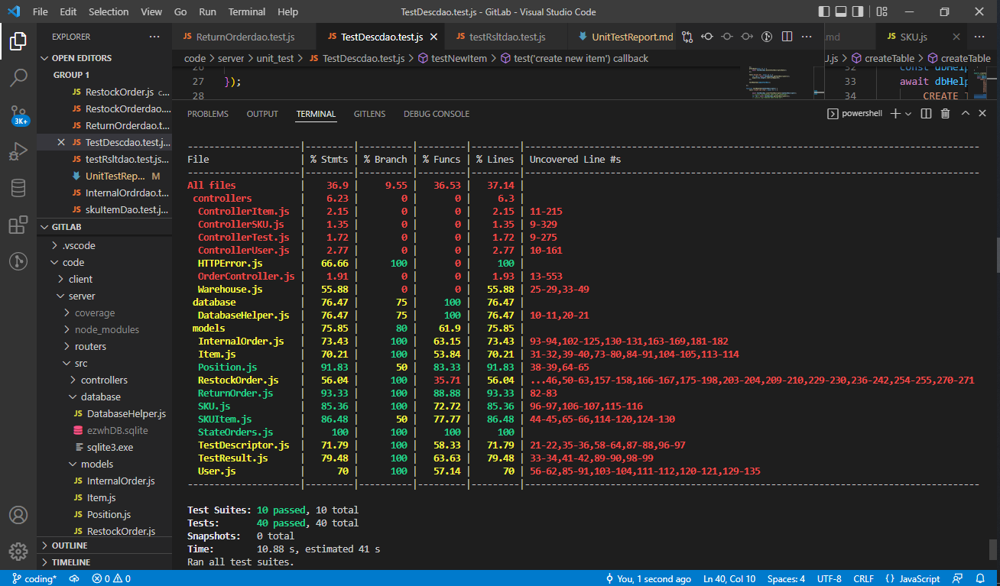

# Unit Testing Report

Date:

Version:

# Contents

- [Black Box Unit Tests](#black-box-unit-tests)

- [White Box Unit Tests](#white-box-unit-tests)

# Black Box Unit Tests

    <Define here criteria, predicates and the combination of predicates for each function of each class.
    Define test cases to cover all equivalence classes and boundary conditions.
    In the table, report the description of the black box test case and (traceability) the correspondence with the Jest test case writing the 
    class and method name that contains the test case>
    <Jest tests  must be in code/server/unit_test  >

### **Class models/SKU.js - method getSKUById**

**Criteria for method getSKUById:**

 -  ID sign

**Predicates for method *name*:**

| Criteria | Predicate |
| -------- | --------- |
| ID sign | > 0 |
|         | < 0 |

**Boundaries**:

| Criteria | Boundary values |
| -------- | --------------- |
| ID sign | ID == 0 |

**Combination of predicates**:

| ID sign | Valid / Invalid | Description of the test case | Jest test case |
|-------|-------|-------|-------|
|> 0| Valid | Try to get a SKU with a positive id | getSKUByPositiveID |
|< 0| Invalid | Try to get a SKU with a negative id | getSKUByNegativeID |
|= 0| Invalid | Try to get a SKU with a id == 0 | getSKUByZeroID |

### **Class models/SKU.js - method insertNewSKU**

**Criteria for method *name*:**

 - Weight sign 
 - Volume sign 
 - Price sign
 - AvailableQuantity sign

**Predicates for method *name*:**

| Criteria | Predicate |
| -------- | --------- |
| Weight sign | > 0 |
|          | < 0 |
| Volume sign | > 0 |
|             | < 0 |
| Price sign | > 0 |
|            | < 0 |
| AvailableQuantity sign | > 0 |
|                        | < 0 |

**Boundaries**:

| Criteria | Boundary values |
| -------- | --------------- |
| Weight sign | = 0 |
| Volume sign | = 0 |
| Price sign | = 0 |
| AvailableQuantity sign | = 0 |

**Combination of predicates**:

| Weight sign | Volume sign | Price sign | AvailableQuantity sign | Valid / Invalid | Jest test case |
|-------|-------|-------|-------|-------|-------|
| > 0| > 0 | > 0 | > 0 | Valid ||
|    | = 0 | > 0 | > 0 | Valid ||
|    |     | = 0 | > 0 | Valid ||
|    |     |     | = 0 | Valid ||
|    |     |     | < 0 | Invalid ||
|    |     | < 0 | > 0 | Invalid ||
|    |     |     | = 0 | Invalid ||

### **Class models/SKU.js - method deleteSKU**

**Criteria for method deleteSKU:**

 - ID sign

**Predicates for method deleteSKUItem:**

| Criteria | Predicate |
| -------- | --------- |
| ID sign | > 0 |
|         | < 0 |

**Boundaries**:

| Criteria | Boundary values |
| -------- | --------------- |
| ID sign | = 0 |

**Combination of predicates**:

| ID sign | Valid / Invalid | Description of the test case | Jest test case |
|-------|-------|-------|-------|
|> 0| Valid | delete a SKU with a positive id| deleteSKUByPositiveID|
|< 0| Invalid | Try to get a SKU with a negative id| deleteSKUByNegativeID|
|= 0| Invalid | Try to get a SKU with a id == 0| deleteSKUByZeroID|

### **Class models/SKUItem.js - method getSKUItemById**

**Criteria for method getSKUItemById:**

 -  ID sign

**Predicates for method getSKUItemById:**

| Criteria | Predicate |
| -------- | --------- |
| ID sign | > 0 |
|         | < 0 |

**Boundaries**:

| Criteria | Boundary values |
| -------- | --------------- |
| ID sign | ID == 0 |

**Combination of predicates**:

| ID sign | Valid / Invalid | Description of the test case | Jest test case |
|-------|-------|-------|-------|
|> 0| Valid | Try to get a SKUItem with a positive id| testInsertNewSkuItemErr|
|< 0| Invalid | Try to get a SKUItem with a negative id| testInsertNewSkuItemErr |
|= 0| Invalid | Try to get a SKUItem with a id == 0| testInsertNewSkuItemErr |

### **Class models/SKUItem.js - method getSKUItemByRFID**

**Criteria for method getSKUItemByRFID:**

 -  RFID sign

**Predicates for method getSKUItemByRFID:**

| Criteria | Predicate |
| -------- | --------- |
| RFID lenght | == 32 |

**Boundaries**:

| Criteria | Boundary values |
| -------- | --------------- |

**Combination of predicates**:

| RFID length | Valid / Invalid | Description of the test case | Jest test case |
|-------|-------|-------|-------|
| == 32 | Valid | Try to get a SKUItem with a positive RFID| testInsertNewSkuItem |
| != 32| Invalid | Try to get a SKUItem with a negative RFID| testInsertNewSkuItemErr |

### **Class models/SKUItem.js - method getSKUItemByInternalOrderID**

**Criteria for method getSKUItemByInternalOrderID:**

 -  InternalOrderID sign

**Predicates for method getSKUItemByInternalOrderID:**

| Criteria | Predicate |
| -------- | --------- |
| InternalOrderID sign | > 0 |
|         | < 0 |

**Boundaries**:

| Criteria | Boundary values |
| -------- | --------------- |
| InternalOrderID sign | InternalOrderID == 0 |

**Combination of predicates**:

| InternalOrderID sign | Valid / Invalid | Description of the test case | Jest test case |
|-------|-------|-------|-------|
|> 0| Valid | Try to get a SKUItem with a positive InternalOrderID| testInsertOrder |
|< 0| Invalid | Try to get a SKUItem with a negative InternalOrderID| testInsertOrder |
|= 0| Invalid | Try to get a SKUItem with a InternalOrderID == 0| testInsertOrder |

### **Class models/SKUItem.js - method getSKUItemByRestockOrderID**

**Criteria for method getSKUItemByRestockOrderID:**

 -  RestockOrderID sign

**Predicates for method getSKUItemByRestockOrderID:**

| Criteria | Predicate |
| -------- | --------- |
| RestockOrderID sign | > 0 |
|                     | < 0 |

**Boundaries**:

| Criteria | Boundary values |
| -------- | --------------- |
| RestockOrderID sign | RestockOrderID == 0 |

**Combination of predicates**:

| RestockOrderID sign | Valid / Invalid | Description of the test case | Jest test case |
|-------|-------|-------|-------|
|> 0| Valid | Try to get a SKUItem with a positive RestockOrderID| testInsertOrder |
|< 0| Invalid | Try to get a SKUItem with a negative RestockOrderID| testInsertOrder |
|= 0| Invalid | Try to get a SKUItem with a RestockOrderID == 0| testInsertOrder |

### **Class models/SKUItem.js - method getSKUItemByReturnOrderID**

**Criteria for method getSKUItemByReturnOrderID:**

 -  ReturnOrderID sign

**Predicates for method getSKUItemByReturnOrderID:**

| Criteria | Predicate |
| -------- | --------- |
| ReturnOrderID sign | > 0 |
|         | < 0 |

**Boundaries**:

| Criteria | Boundary values |
| -------- | --------------- |
| ReturnOrderID sign | ReturnOrderID == 0 |

**Combination of predicates**:

| ReturnOrderID sign | Valid / Invalid | Description of the test case | Jest test case |
|-------|-------|-------|-------|
|> 0| Valid | Try to get a SKUItem with a positive ReturnOrderID| testInsertOrder |
|< 0| Invalid | Try to get a SKUItem with a negative ReturnOrderID| testInsertOrder |
|= 0| Invalid | Try to get a SKUItem with a ReturnOrderID == 0| testInsertOrder |

### **Class models/SKUItem.js - method insertNewSKUItem**

**Criteria for method insertNewSKUItem:**

 - SKUID sign
 - RFID length

**Predicates for method insertNewSKUItem:**

| Criteria | Predicate |
| -------- | --------- |
| SKUItemID sign | > 0 |
|          | < 0 |
| RFID lenght | == 32 |
|            | != 32 |

**Boundaries**:

| Criteria | Boundary values |
| -------- | --------------- |
| SKUItemID sign | = 0 |

**Combination of predicates**:

| SKUItemID sign | RFID lenght | Valid / Invalid | Description | Jest test case |
|-------|-------|-------|-------|-------|
| > 0 | == 32 | Valid | Insertion of a correct skuItem | testInsertNewSkuItem |
| <= 0 | != 32 | Invalid | Insertion of a non correct skuItem | testInsertNewSkuItemErr |

### **Class models/SKUItem.js - method insertRestockOrder**

**Criteria for method insertRestockOrder:**
 - RestockOrderID sign

**Predicates for method insertRestockOrder:**

| Criteria | Predicate |
| -------- | --------- |
| RestockOrderID sign | > 0 |
|            | < 0 |

**Boundaries**:

| Criteria | Boundary values |
| -------- | --------------- |
| RestockOrderID sign | = 0 |

**Combination of predicates**:

| RestockOrderID sign | Valid / Invalid | Description | Jest test case |
|-------|-------|-------|-------|
| > 0 | Valid | insert a RestockOrder with positive id | testInsertOrder |
| <= 0 | Invalid | insert a RestockOrder with negative or zero id | testInsertOrderErr |

### **Class models/SKUItem.js - method insertInternalOrder**

**Criteria for method insertInternalOrder:**
 - InternalOrderID sign

**Predicates for method insertInternalOrder:**

| Criteria | Predicate |
| -------- | --------- |
| InternalOrderID sign | > 0 |
|            | < 0 |

**Boundaries**:

| Criteria | Boundary values |
| -------- | --------------- |
| InternalOrderID sign | = 0 |

**Combination of predicates**:

| InternalOrderID sign | Valid / Invalid | Description | Jest test case |
|-------|-------|-------|-------|
| > 0 | Valid | insert a InternalOrder with positive id | testInsertOrder |
| <= 0 | Invalid | insert a InternalOrder with negative or zero id | testInsertOrderErr |

### **Class models/SKUItem.js - method insertReturnOrder**

**Criteria for method insertReturnOrder:**
 - ReturnOrderID sign

**Predicates for method insertReturnOrder:**

| Criteria | Predicate |
| -------- | --------- |
| ReturnOrderID sign | > 0 |
|            | < 0 |

**Boundaries**:

| Criteria | Boundary values |
| -------- | --------------- |
| ReturnOrderID sign | = 0 |

**Combination of predicates**:

| ReturnOrderID sign | Valid / Invalid | Description | Jest test case |
|-------|-------|-------|-------|
| > 0 | Valid | insert a ReturnOrder with positive id | testInsertOrder |
| <= 0 | Inalid | insert a ReturnOrder with negative or zero id | testInsertOrderErr |

### **Class models/SKUItem.js - method updateSKUItem**

**Criteria for method updateSKUItem:**

 - RFID lenght
 - Available sign

**Predicates for method updateSKUItem:**

| Criteria | Predicate |
| -------- | --------- |
| RFID lenght | == 0 |
|          | != 0 |
| Available sign | > 0 |
|            | < 0 |

**Boundaries**:

| Criteria | Boundary values |
| -------- | --------------- |
| Available sign | = 0 |

**Combination of predicates**:

| RFID lenght | Available sign | Valid / Invalid | Description | Jest test case |
|-------|-------|-------|-------|-------|
| == 32 | > 0 | Valid |   update a SKUItem with positive id, correct RFID | testInsertNewSkuItem |
| != 32 | <= 0 | Invalid | update a SKUItem with negative or null id, non correct RFID | testInsertNewSkuItem |

### **Class models/position.js - method getPositionById**

**Criteria for method getPositionById:**

 -  ID sign

**Predicates for method getPositionById:**

| Criteria | Predicate |
| -------- | --------- |
| ID sign | > 0 |
|         | < 0 |

**Boundaries**:

| Criteria | Boundary values |
| -------- | --------------- |
| ID sign | ID == 0 |

**Combination of predicates**:

| ID sign | Valid / Invalid | Description of the test case | Jest test case |
|-------|-------|-------|-------|
|> 0| Valid | Try to get a Position with a positive id| testCreatePosition |
|< 0| Invalid | Try to get a Position with a negative id| testCreatePositionErr|
|= 0| Invalid | Try to get a SKU with a id == 0| testCreatePositionErr |

### **Class models/Position.js - method updatePosition**

**Criteria for method updatePosition:**
 
 - aisle id	length
 - row length
 - col length

**Predicates for method updatePosition:**

| Criteria | Predicate |
| -------- | --------- |
| aisle id length | == 4 |
|          | != 4 |
| row length | == 4 |
|          | != 4 |
| col length | == 4 |
|          | != 4 |

**Boundaries**:

| Criteria | Boundary values |
| -------- | --------------- |
|||

**Combination of predicates**:
| aisle id length | row length | col length | Valid / Invalid | Description of the test case | Jest test case |
|-------|-------|-------|-------|-------|-------|
| == 4 | == 4 | == 4 | Valid | only valid combination to update a position with correct values | updatePositionAisleRowCol |
| != 4 | != 4 | != 4 | Invalid | if any of these value is different from 4 results an error | updatePositionAisleRowColErr |

### **Class models/Position.js - method updatePosition**

**Criteria for method updatePosition:**
 
 - occupiedWeight
 - occupiedVolume

**Predicates for method updatePosition:**

| Criteria | Predicate |
| -------- | --------- |
| occupied weight value | <= MaxWeight |
|   |> MaxWeight|
| occupied volume value | <= maxVolume |
|   |>MaxVolume|

**Boundaries**:

| Criteria | Boundary values |
| -------- | --------------- |
|||

**Combination of predicates**:
| occupied weight value | occupied volume value | Valid / Invalid | Description of the test case | Jest test case |
|-------|-------|-------|-------|-------|
| <= MaxWeight | <= MaxVolume | Valid | only valid combination to update a position with correct values | updatePositionWeightVolume |
| > MaxWeight | > MaxVolume | Invalid | if any of these value higher results an error | updatePositionWeightVolumeErr |

### **Class models/Position.js - method insertNewPosition**

**Criteria for method insertNewPosition:**

 - positionID sign
 - maxWeight sign
 - maxVolume sign

**Predicates for method insertNewPosition:**

| Criteria | Predicate |
| -------- | --------- |
| positionID sign | > 0 |
|          | < 0 |
| maxWeight sign | > 0 |
|            | < 0 |
| maxVolume sign | > 0 |
|            | < 0 |

**Boundaries**:

| Criteria | Boundary values |
| -------- | --------------- |
| positionID sign | = 0 |
| maxWeight sign | = 0 |
| maxVolume sign | = 0 |

**Combination of predicates**:

| positionID sign | maxWeight sign | maxVolume sign | Valid / Invalid | Description | Jest test case |
|-------|-------|-------|-------|-------|-------|
| > 0 | > 0 | > 0 | Valid   | insert a position with positive id, positive maxWeight, positive maxVolume 	| testCreatePosition |
| > 0 | > 0 | < 0 | Invalid | insert a position with positive id, positive maxWeight, negative maxVolume 	| testCreatePositionErr |
| > 0 | > 0 | = 0 | Invalid | insert a position with positive id, positive maxWeight, Zero maxVolume     	| testCreatePositionErr |
| > 0 | < 0 | > 0 | Invalid | insert a position with positive id, negative maxWeight, positive maxVolume 	| testCreatePositionErr |
| > 0 | < 0 | < 0 | Invalid | insert a position with positive id, negative maxWeight, negative maxVolume 	| testCreatePositionErr |
| > 0 | < 0 | = 0 | Invalid | insert a position with positive id, negative maxWeight, Zero maxVolume     	| testCreatePositionErr |
| > 0 | = 0 | > 0 | Invalid | insert a position with positive id, Zero maxWeight, positive maxVolume     	| testCreatePositionErr |
| > 0 | = 0 | < 0 | Invalid | insert a position with positive id, Zero maxWeight, negative maxVolume     	| testCreatePositionErr |
| > 0 | = 0 | = 0 | Invalid | insert a position with positive id, Zero maxWeight, Zero maxVolume         	| testCreatePositionErr |
| < 0 | > 0 | > 0 | Invalid | insert a Position with a negative id, positive maxWeight, positive maxVolume 	| testCreatePositionErr |
| < 0 | > 0 | < 0 | Invalid | insert a Position with a negative id, positive maxWeight, negative maxVolume 	| testCreatePositionErr |
| < 0 | > 0 | = 0 | Invalid | insert a Position with a negative id, positive maxWeight, Zero maxVolume     	| testCreatePositionErr |
| < 0 | < 0 | > 0 | Invalid | insert a Position with a negative id, negative maxWeight, positive maxVolume 	| testCreatePositionErr |
| < 0 | < 0 | < 0 | Invalid | insert a Position with a negative id, negative maxWeight, negative maxVolume 	| testCreatePositionErr |
| < 0 | < 0 | = 0 | Invalid | insert a Position with a negative id, negative maxWeight, Zero maxVolume     	| testCreatePositionErr |
| < 0 | = 0 | > 0 | Invalid | insert a Position with a negative id, Zero maxWeight, positive maxVolume     	| testCreatePositionErr |
| < 0 | = 0 | < 0 | Invalid | insert a Position with a negative id, Zero maxWeight, negative maxVolume     	| testCreatePositionErr |
| < 0 | = 0 | = 0 | Invalid | insert a Position with a negative id, Zero maxWeight, Zero maxVolume         	| testCreatePositionErr |
| = 0 | > 0 | > 0 | Invalid | insert a Position with a Zero id, positive maxWeight, positive maxVolume  	| testCreatePositionErr |
| = 0 | > 0 | < 0 | Invalid | insert a Position with a Zero id, positive maxWeight, negative maxVolume  	| testCreatePositionErr |
| = 0 | > 0 | = 0 | Invalid | insert a Position with a Zero id, positive maxWeight, Zero maxVolume      	| testCreatePositionErr |
| = 0 | < 0 | > 0 | Invalid | insert a Position with a Zero id, negative maxWeight, positive maxVolume  	| testCreatePositionErr |
| = 0 | < 0 | < 0 | Invalid | insert a Position with a Zero id, negative maxWeight, negative maxVolume  	| testCreatePositionErr |
| = 0 | < 0 | = 0 | Invalid | insert a Position with a Zero id, negative maxWeight, Zero maxVolume      	| testCreatePositionErr |
| = 0 | = 0 | > 0 | Invalid | insert a Position with a Zero id, Zero maxWeight, positive maxVolume      	| testCreatePositionErr |
| = 0 | = 0 | < 0 | Invalid | insert a Position with a Zero id, Zero maxWeight, negative maxVolume      	| testCreatePositionErr |
| = 0 | = 0 | = 0 | Invalid | insert a Position with a Zero id, Zero maxWeight, Zero maxVolume          	| testCreatePositionErr |

### **Class models/SKU.js - method deletePosition**

**Criteria for method deletePosition:**

 -  position ID sign

**Predicates for method deletePosition:**

| Criteria | Predicate |
| -------- | --------- |
| position ID sign | > 0 |
|         | < 0 |

**Boundaries**:

| Criteria | Boundary values |
| -------- | --------------- |
| position ID sign | = 0 |

**Combination of predicates**:

| position ID sign | Valid / Invalid | Description of the test case | Jest test case |
|-------|-------|-------|-------|
|> 0| Valid | delete a position with a positive id| testDeletePosition |
|< 0| Invalid | Try to get a SKU with a negative id| testDeletePosition |
|= 0| Invalid | Try to get a SKU with a id == 0| testDeletePosition |

### **Class models/TestDescriptor.js - method getTestDescriptorById**

**Criteria for method getgetTestDescriptorById:**

 -  ID sign

**Predicates for method *name*:**

| Criteria | Predicate |
| -------- | --------- |
| ID sign | > 0 |
|         | < 0 |

**Boundaries**:

| Criteria | Boundary values |
| -------- | --------------- |
| ID sign | ID == 0 |

**Combination of predicates**:

| ID sign | Valid / Invalid | Description of the test case | Jest test case |
|-------|-------|-------|-------|
|> 0| Valid | Try to get a TestDescriptor with a positive id| getItemByPositiveID|
|< 0| Invalid | Try to get a TestDescriptor with a negative id|getItemByNegativeID|
|= 0| Invalid | Try to get a TestDescriptor with a id == 0|getItemZeroID|

### **Class models/TestDescriptor.js - method getTestDescriptorBySKUId**

**Criteria for method getTestDescriptorBySKUId:**

 -  SKUId sign

**Predicates for method *name*:**

| Criteria | Predicate |
| -------- | --------- |
| SKUId sign | > 0 |
|         | < 0 |

**Boundaries**:

| Criteria | Boundary values |
| -------- | --------------- |
| SKUId sign | ID == 0 |

**Combination of predicates**:

| SKUId sign | Valid / Invalid | Description of the test case | Jest test case |
|-------|-------|-------|-------|
|> 0| Valid | Try to get a TestDescriptor with a positive SKUId| getTestDescriptorBySKUId|
|< 0| Invalid | Try to get a TestDescriptor with a negative SKUId|getTestDescriptorBySKUId|
|= 0| Invalid | Try to get a TestDescriptor with a SKUId == 0|getTestDescriptorBySKUId|

### **Class models/TestDescriptor.js - method insertTestDescriptor**

**Criteria for method *name*:**

 - name chracter
 - SKUId sign

**Predicates for method *name*:**

| Criteria | Predicate |
| -------- | --------- |
| name characters | > 0 |
|          | < 0 |
| SKUId sign | > 0 |
|            | < 0 |

**Boundaries**:

| Criteria | Boundary values |
| -------- | --------------- |
| name character  | = 0 |
| SKUId sign | = 0 |

**Combination of predicates**:

| name character | SKUId sign | Valid / Invalid | Jest test case |
|-------|-------|-------|-------|
| > 0| > 0 | Valid ||
| = 0| > 0 | Invalid ||
| > 0| = 0 | Invalid ||

### **Class models/TestDescriptor.js - method updateTestDescriptor**

 **Criteria for method *name*:**

 - name chracter
 - SKUId sign

**Predicates for method *name*:**

| Criteria | Predicate |
| -------- | --------- |
| name characters  | > 0 |
|          | < 0 |
| SKUId sign | > 0 |
|            | < 0 |

**Boundaries**:

| Criteria | Boundary values |
| -------- | --------------- |
| name character  | = 0 |
| SKUId sign | = 0 |

**Combination of predicates**:

| name character  | SKUId sign | Valid / Invalid | Jest test case |
|-------|-------|-------|-------|
| > 0| > 0 | Valid ||
| = 0| > 0 | Invalid ||
| > 0| = 0 | Invalid ||

### **Class models/TestDescriptor.js - method deleteTestDesc

**Criteria for method *name*:**

 - Id sign

**Predicates for method *name*:**

| Criteria | Predicate |
| -------- | --------- |
| id sign | > 0 |
|          | < 0 |

**Boundaries**:

| Criteria | Boundary values |
| -------- | --------------- |
| id sign | = 0 |

**Combination of predicates**:

| ID sign | Valid / Invalid | Description of the test case | Jest test case |
|-------|-------|-------|-------|
|> 0| Valid | Try to get a id with a positive id| getTestDescriptorByPositiveId|
|< 0| Invalid | Try to get a id with a negative id|getTestDescriptorByNegativeId|
|= 0| Invalid | Try to get a id with a id == 0|getTestDescriptorByZeroId|

### **Class models/TestResult.js - method getTestResults**

**Criteria for method getTestResults:**

 -  rfid sign

**Predicates for method *name*:**

| Criteria | Predicate |
| -------- | --------- |
| rfid sign | > 0 |
|           | < 0 |

**Boundaries**:

| Criteria | Boundary values |
| -------- | --------------- |
| rfid sign | rfid == 0 |

**Combination of predicates**:

| ID sign | Valid / Invalid | Description of the test case | Jest test case |
|-------|-------|-------|-------|
|> 0| Valid | Try to get a TestResult with a positive rfid| getItemByPositiveID|
|< 0| Valid | Try to get a TestResult with a negative rfid|getItemByNegativeID|
|= 0| Invalid | Try to get a TestResult with a rfid == 0|getItemZeroID|

### **Class models/TestResult.js - method getTestResultById**

**Criteria for method getTestREsultById:**

 -  id sign
 -  rfid character

**Predicates for method *name*:**

| Criteria | Predicate |
| -------- | --------- |
| rfid sign  | > 0 |
|          | < 0 |
| SKUId sign | > 0 |
|            | < 0 |

**Boundaries**:

| Criteria | Boundary values |
| -------- | --------------- |
| SKUId sign | ID == 0 |

**Combination of predicates**:

| rfid sign  | id sign | Valid / Invalid | Jest test case |
|-------|-------|-------|-------|
| > 0| > 0 | Valid ||
| = 0| > 0 | Invalid ||
|    | = 0 | Invalid ||
|    | < 0 | Invalid ||

### **Class models/TestResult.js - method insertTestResult**

**Criteria for method *name*:**

 -  id sign
 -  rfid sign
 -  Date
 -  Result

**Predicates for method *name*:**

| Criteria | Predicate |
| -------- | --------- |
| id  sign | > 0 |
|          | < 0 |
| rfid sign | > 0 |
|            | < 0 |
| Date sign | > 0 |
|          | < 0 |
| Result sign | Y |
|            | N |

**Boundaries**:

| Criteria | Boundary values |
| -------- | --------------- |
| id sign | = 0 |
| rfid  sign | = 0 |
| Date sign | = 0 |

**Combination of predicates**:

| id sign | rfid sign | Date sign | Result sign | Valid / Invalid | Jest test case |
|-------|-------|-------|-------|-------|-------|
| > 0| > 0 | > 0 | > 0 | Valid ||
| = 0| > 0 | > 0 | > 0 | Invalid ||
|    | = 0 | > 0 | > 0 | Invalid ||
|    |     | = 0 | > 0 | Valid ||
|    |     | < 0 | > 0 | Invalid ||
|    |     |     | > 0 | Valid ||
|    |     |     | < 0 | Invalid ||

### **Class models/TestResult.js - method updateTestResult**

**Criteria for method *name*:**

 -  id sign
 -  rfid sign
 -  Date
 -  Result

**Predicates for method *name*:**

| Criteria | Predicate |
| -------- | --------- |
| id  sign | > 0 |
|          | < 0 |
| rfid sign | > 0 |
|            | < 0 |
| Date sign | > 0 |
|          | < 0 |
| Result sign | Y |
|            | N |

**Boundaries**:

| Criteria | Boundary values |
| -------- | --------------- |
| id sign | = 0 |
| rfid  sign | = 0 |
| Date sign | = 0 |

**Combination of predicates**:

| id sign | rfid sign | Date sign | Result sign | Valid / Invalid | Jest test case |
|-------|-------|-------|-------|-------|-------|
| > 0| > 0 | > 0 | > 0 | Valid ||
| = 0| > 0 | > 0 | > 0 | Invalid ||
|    | < 0 | > 0 | > 0 | Valid ||
|    | = 0 | > 0 | > 0 | Invalid ||
|    |     | = 0 | > 0 | Valid ||
|    |     | < 0 | > 0 | Invalid ||
|    |     |     | > 0 | Valid ||
|    |     |     | < 0 | Invalid ||

### **Class models/TestResult.js - method deleteTestResult**

**Criteria for method deleteTestResult:**
 
 -  rfid sign
 -  id sign

**Predicates for method *name*:**

| Criteria | Predicate |
| -------- | --------- |
| rfid sign  | > 0 |
|          | < 0 |
| id sign | > 0 |
|            | < 0 |

**Boundaries**:

| Criteria | Boundary values |
| -------- | --------------- |
| id sign | ID == 0 |

**Combination of predicates**:

| rfid character  | id sign | Valid / Invalid | Jest test case |
|-------|-------|-------|-------|
| > 0| > 0 | Valid ||
| = 0| > 0 | Invalid ||
|    | = 0 | Invalid ||
|    | < 0 | Invalid ||

### **Class models/Item.js - method getItem**

**Criteria for method getItem:**

 -  ID sign

**Predicates for method *name*:**

| Criteria | Predicate |
| -------- | --------- |
| ID sign | > 0 |
|         | < 0 |

**Boundaries**:

| Criteria | Boundary values |
| -------- | --------------- |
| ID sign | ID == 0 |

**Combination of predicates**:

| ID sign | Valid / Invalid | Description of the test case | Jest test case |
|-------|-------|-------|-------|
|> 0| Valid | Try to get a Item with a positive id| getItemByPositiveID|
|< 0| Invalid | Try to get a Item with a negative id|getItemByNegativeID|
|= 0| Invalid | Try to get a Item with a id == 0|getItemZeroID|

### **Class models/Item.js - method getItemsBySupplyId**

**Criteria for method getItemsBySupplyId:**

 -  supplierId sign

**Predicates for method *name*:**

| Criteria | Predicate |
| -------- | --------- |
| supplierId sign | > 0 |
|         | < 0 |

**Boundaries**:

| Criteria | Boundary values |
| -------- | --------------- |
| supplierId sign | ID == 0 |

**Combination of predicates**:

| supplierId sign | Valid / Invalid | Description of the test case | Jest test case |
|-------|-------|-------|-------|
|> 0| Valid | Try to get a Item with a positive supplierId| getItemBySupplierPositiveID|
|< 0| Invalid | Try to get a Item with a negative supplierId|getItemByNegativeSupplierID|
|= 0| Invalid | Try to get a Item with a supplierId == 0|getItemZeroSupplierID|

### **Class models/Item.js - method getItemBySKUIdAndSupplId**

**Criteria for method getItemBySKUIdAndSupplId:**

 -  supplierId sign
 -  SKUId sign

**Predicates for method *name*:**

| Criteria | Predicate |
| -------- | --------- |
| supplierIdD sign | > 0 |
|         | < 0 |
| SKUId sign | > 0 |
|         | < 0 |

**Boundaries**:

| Criteria | Boundary values |
| -------- | --------------- |
| supplierId sign | ID == 0 |
| SKUId sign | ID == 0 |

**Combination of predicates**:

**Combination of predicates**:

 supplierId sign | SKUIdd sign | Valid / Invalid | Jest test case |
|-------|-------|-------|-------|
| > 0 | > 0 | Valid ||
| = 0 | > 0 | Valid ||
|     | = 0 | Invalid ||

### **Class models/Item.js - method insertNewItem**

**Criteria for method *name*:**

 - Id sign
 - Price sign 
 - SKUId sign
 - supplierId sign

**Predicates for method *name*:**

| Criteria | Predicate |
| -------- | --------- |
| id sign | > 0 |
|          | < 0 |
| Price sign | > 0 |
|             | < 0 |
| SKUId sign | > 0 |
|            | < 0 |
| supplierId sign | > 0 |
|                 | < 0 |

**Boundaries**:

| Criteria | Boundary values |
| -------- | --------------- |
| id sign | = 0 |
| Price sign | = 0 |
| SKUId sign | = 0 |
| supplierId sign | = 0 |

**Combination of predicates**:
//Price would be zero in the cases where the item has an difect and sending item again which doesnt has diffect. 

| id sign | Price sign | SKUId sign | supplierId sign | Valid / Invalid | Jest test case |
|-------|-------|-------|-------|-------|-------|
| > 0| > 0 | > 0 | > 0 | Valid ||
| > 0| = 0 | > 0 | > 0 | Valid ||
|    |     | = 0 | > 0 | Invalid ||
|    |     |     | = 0 | Invalid ||

### **Class models/Item.js - method updateItem**

**Criteria for method *name*:**

 - Id sign
 - Price sign 
 

**Predicates for method *name*:**

| Criteria | Predicate |
| -------- | --------- |
| id sign | > 0 |
|          | < 0 |
| Price sign | > 0 |
|             | < 0 |

**Boundaries**:

| Criteria | Boundary values |
| -------- | --------------- |
| id sign | = 0 |
| Price sign | = 0 |

**Combination of predicates**:
//Price would be zero in the cases where the item has an difect and sending item again which doesnt has diffect. 

| Price sign | id sign | Valid / Invalid | Jest test case |
|-------|-------|-------|-------|
| > 0 | > 0 | Valid ||
| = 0 | > 0 | Valid ||
|     | = 0 | Invalid ||

### **Class models/Item.js - method deleteItem**

**Criteria for method *name*:**

 - Id sign

**Predicates for method *name*:**

| Criteria | Predicate |
| -------- | --------- |
| id sign | > 0 |
|          | < 0 |

**Boundaries**:

| Criteria | Boundary values |
| -------- | --------------- |
| id sign | = 0 |

**Combination of predicates**:

| ID sign | Valid / Invalid | Description of the test case | Jest test case |
|-------|-------|-------|-------|
|> 0| Valid | Try to get a id with a positive id| getSKUByPositiveID|
|< 0| Invalid | Try to get a id with a negative id|getSKUByNegativeID|
|= 0| Invalid | Try to get a id with a id == 0|getSKUByZeroID|

### **Class models/RestockOrder.js - method getTransportNoteById**

**Criteria for method getTransportNoteById:**

 -  id sign

**Predicates for method *name*:**

| Criteria | Predicate |
| -------- | --------- |
| id sign | > 0 |
|         | < 0 |

**Boundaries**:

| Criteria | Boundary values |
| -------- | --------------- |
| id sign | ID == 0 |

**Combination of predicates**:

| id sign | Valid / Invalid | Description of the test case | Jest test case |
|-------|-------|-------|-------|
|> 0| Valid | Try to get a TransportNoteById with a positive id| getTransportNoteByPositiveID|
|< 0| Invalid | Try to get a TransportNoteById with a negative id|getTransportNoteByNegativeID|
|= 0| Invalid | Try to get a TransportNoteById with a id == 0|getTransportNoteByZeroID|

### **Class models/RestockOrder.js - method insertTransportNote**

**Criteria for method *name*:**

 - DeliveryDate sign

**Predicates for method *name*:**

| Criteria | Predicate |
| -------- | --------- |
| DeliveryDate sign | > 0 |
|          | < 0 |

**Boundaries**:

| Criteria | Boundary values |
| -------- | --------------- |
| DeliveryDate sign sign | = 0 |

**Combination of predicates**:

| id sign | Valid / Invalid | Jest test case |
|-------|-------|-------|-------|-------|-------|
| > 0| Valid ||
| = 0| Invalid ||

### **Class models/RestockOrder.js - method getRestockOrderById**

**Criteria for method getRestockOrderById:**

 -  id sign

**Predicates for method *name*:**

| Criteria | Predicate |
| -------- | --------- |
| id sign | > 0 |
|         | < 0 |

**Boundaries**:

| Criteria | Boundary values |
| -------- | --------------- |
| id sign | ID == 0 |

**Combination of predicates**:

| id sign | Valid / Invalid | Description of the test case | Jest test case |
|-------|-------|-------|-------|
|> 0| Valid | Try to get a TransportNoteById with a positive id| getItemBySupplierPositiveID|
|< 0| Invalid | Try to get a TransportNoteById with a negative id|getTransportNoteByNegativeID|
|= 0| Invalid | Try to get a TransportNoteById with a id == 0|getTransportNoteByZeroID|

### **Class models/RestockOrder.js - method insertNewRestockOrder**

**Criteria for method *name*:**

 - DeliveryDate sign
 - supplierId sign
 - state sign

**Predicates for method *name*:**

| Criteria | Predicate |
| -------- | --------- |
| issueDate sign | > 0 |
|          | < 0 |
| supplierId sign | > 0 |
|             | < 0 |
| state sign | > 0 |
|            | < 0 |

**Boundaries**:

| Criteria | Boundary values |
| -------- | --------------- |
| issueDate sign | = 0 |
| supplierId sign | = 0 |
| state sign | = 0 |

**Combination of predicates**:
//Price would be zero in the cases where the item has an difect and sending item again which doesnt has diffect. 

| issueDate sign | supplierId sign | state sign | Valid / Invalid | Jest test case |
|-------|-------|-------|-------|-------|
| > 0 | > 0 | > 0 | Valid ||
|     | > 0 | > 0 | Valid ||
|     |     | > 0 | Invalid ||
|     |     |     | Invalid ||

### **Class models/RestockOrder.js - method updateRestockOrderStatus**

**Criteria for method *name*:**

 - Id sign
 - State sign 
 

**Predicates for method *name*:**

| Criteria | Predicate |
| -------- | --------- |
| id sign | > 0 |
|          | < 0 |
| State sign | > 0 |
|             | < 0 |

**Boundaries**:

| Criteria | Boundary values |
| -------- | --------------- |
| id sign | = 0 |
| State sign | = 0 |

**Combination of predicates**:

| State sign | id sign | Valid / Invalid | Jest test case |
|-------|-------|-------|-------|
| > 0 | > 0 | Valid ||
| = 0 | > 0 | Valid ||
|     | = 0 | Invalid ||

### **Class models/RestockOrder.js - method updateRestockOrderTranspNote**

**Criteria for method *name*:**

 - Id sign
 - transpNoteId sign 
 

**Predicates for method *name*:**

| Criteria | Predicate |
| -------- | --------- |
| id sign | > 0 |
|          | < 0 |
| transpNoteId sign | > 0 |
|             | < 0 |

**Boundaries**:

| Criteria | Boundary values |
| -------- | --------------- |
| id sign | = 0 |
| transpNoteId sign | = 0 |

**Combination of predicates**:

| transpNoteId sign | id sign | Valid / Invalid | Jest test case |
|-------|-------|-------|-------|
| > 0 | > 0 | Valid ||
| = 0 | > 0 | Valid ||
|     | = 0 | Invalid ||

### **Class models/RestockOrder.js - method deleteRestockOrder**

**Criteria for method deleteRestockOrder:**

 -  id sign

**Predicates for method *name*:**

| Criteria | Predicate |
| -------- | --------- |
| id sign | > 0 |
|         | < 0 |

**Boundaries**:

| Criteria | Boundary values |
| -------- | --------------- |
| id sign | ID == 0 |

**Combination of predicates**:

| id sign | Valid / Invalid | Description of the test case | Jest test case |
|-------|-------|-------|-------|
|> 0| Valid | Try to get a RestockOrderById with a positive id| getRestockOrderByPositiveID|
|< 0| Invalid | Try to get a RestockOrderById with a negative id|getRestockOrderByNegativeID|
|= 0| Invalid | Try to get a RestockOrderById with a id == 0|getRestockOrderByZeroID|

### **Class models/RestockOrder.js - method getJoinByRstkOrdId**

**Criteria for method getJoinByRstkOrdId:**

 -  restockOrderId sign

**Predicates for method *name*:**

| Criteria | Predicate |
| -------- | --------- |
| restockOrderId sign | > 0 |
|         | < 0 |

**Boundaries**:

| Criteria | Boundary values |
| -------- | --------------- |
| restockOrderId sign | ID == 0 |

**Combination of predicates**:

| restockOrderId sign | Valid / Invalid | Description of the test case | Jest test case |
|-------|-------|-------|-------|
|> 0| Valid | Try to get a getJoinByRstkOrdId with a positive restockOrderId| getJoinByRstkOrdPositiveID|
|< 0| Invalid | Try to get a getJoinByRstkOrdId with a negative restockOrderId|getJoinByRstkOrdNegativeID|
|= 0| Invalid | Try to get a getJoinByRstkOrdId with a restockOrderId == 0|getJoinByRstkOrdZeroID|

### **Class models/RestockOrder.js - method insertJoin**

**Criteria for method *name*:**

 - restockOrdId sign
 - SKUId sign
 - price sign
 - qty

**Predicates for method *name*:**

| Criteria | Predicate |
| -------- | --------- |
| restockOrdId sign | > 0 |
|          | < 0 |
| SKUId sign | > 0 |
|             | < 0 |
| price sign | > 0 |
|            | < 0 |
| qty sign | > 0 |
|            | < 0 |

**Boundaries**:

| Criteria | Boundary values |
| -------- | --------------- |
| restockOrdId sign | = 0 |
| SKUId sign | = 0 |
| price sign | = 0 |
| qty sign | = 0 |

**Combination of predicates**:

| restockOrdId sign | SKUId sign | price sign | qty sign | Valid / Invalid | Jest test case |
|-------|-------|-------|-------|-------|
| > 0 | > 0 | > 0 | > 0 | Valid ||
|     | > 0 | > 0 | > 0 | Valid ||
|     |     | > 0 | > 0 | Valid ||
|     |     |     | > 0 | Valid ||

## **Class models/RestockOrder.js - method deleteJoin**

**Criteria for method deleteJoin:**

 -  restockOrderId sign

**Predicates for method *name*:**

| Criteria | Predicate |
| -------- | --------- |
| restockOrderId sign | > 0 |
|         | < 0 |

**Boundaries**:

| Criteria | Boundary values |
| -------- | --------------- |
| restockOrderId sign | ID == 0 |

**Combination of predicates**:

| restockOrderId sign | Valid / Invalid | Description of the test case | Jest test case |
|-------|-------|-------|-------|
|> 0| Valid | Try to get a deleteJoin with a positive restockOrderId| deleteJoinByPositiveID|
|< 0| Invalid | Try to get a deleteJoin with a negative restockOrderId|deleteJoinByNegativeID|
|= 0| Invalid | Try to get a deleteJoin with a restockOrderId == 0|deleteJoinByZeroID|

### **Class models/User.js - method getUserById**

**Criteria for method getUserById:**

 -  id sign

**Predicates for method *name*:**

| Criteria | Predicate |
| -------- | --------- |
| id sign | > 0 |
|         | < 0 |

**Boundaries**:

| Criteria | Boundary values |
| -------- | --------------- |
| id sign | ID == 0 |

**Combination of predicates**:

| restockOrderId sign | Valid / Invalid | Description of the test case | Jest test case |
|-------|-------|-------|-------|
|> 0| Valid | Try to get a getUserById with a positive id| getUserByPositiveID|
|< 0| Invalid | Try to get a getUserById with a negative id|getUserByNegativeID|
|= 0| Invalid | Try to get a getUserById with a id == 0|getUserByZeroID|

### **Class models/User.js - method getUserByEmailType**

**Criteria for method getUserById:**

 -  email char
 -  type char

**Predicates for method *name*:**

| Criteria | Predicate |
| -------- | --------- |
| email char | > 0 |
|        | < 0 |
| type char | > 0 |
|        | < 0 |

**Boundaries**:

| Criteria | Boundary values |
| -------- | --------------- |
| email char | ID == 0 |
| type char | ID == 0 |

**Combination of predicates**:

| email char | type char | Valid / Invalid | Description of the test case | Jest test case |
|-------|-------|-------|-------|
|> 0 | > 0 | Valid   | |
|< 0 | > 0 | Valid   | |
|> 0 | < 0 | Valid   | |
|= 0 | > 0 | Invalid | |
|    | = 0 | Invalid | |

### **Class models/User.js - method insertNewUser**

**Criteria for method *name*:**

 - name char
 - surname char
 - email char
 - type char
 - passwordHash sign
 

**Predicates for method *name*:**

| Criteria | Predicate |
| -------- | --------- |
| name char | > 0 |
|          | < 0 |
| surname char | > 0 |
|             | < 0 |
| email char | > 0 |
|            | < 0 |
| type char | > 0 |
|            | < 0 |
| passwordHash sign | > 0 |
|            | < 0 |

**Boundaries**:

| Criteria | Boundary values |
| -------- | --------------- |
| name char | = 0 |
| surname char | = 0 |
| email char | = 0 |
| type char | = 0 |
| passwordHash sign | = 0 |

**Combination of predicates**:

| restockOrdId sign | SKUId sign | price sign | qty sign | Valid / Invalid | Jest test case |
|-------|-------|-------|-------|-------|
| > 0 | > 0 | > 0 | > 0 | > 0 | Valid ||
| < 0 | > 0 | > 0 | > 0 | > 0 | Valid ||
| > 0 | < 0 | > 0 | > 0 | > 0 | Valid ||
| > 0 | > 0 | < 0 | > 0 | > 0 | Valid ||
| > 0 | > 0 | > 0 | < 0 | > 0 | Valid ||
| > 0 | > 0 | > 0 | > 0 | = 0 | Valid ||
| > 0 | > 0 | > 0 | > 0 | < 0 | Invalid ||
| > 0 | > 0 | > 0 | = 0 |     | Invalid ||
| > 0 | > 0 | = 0 |     |     | Invalid ||
| > 0 | = 0 |     |     |     | Invalid ||
| = 0 |     |     |     |     | Invalid ||

### **Class models/User.js - method updateUser**

**Criteria for method updateUser:**
-  email char
-  type char

**Predicates for method *name*:**

| Criteria | Predicate |
| -------- | --------- |
| email char | > 0 |
|        | < 0 |
| type char | > 0 |
|        | < 0 |

**Boundaries**:

| Criteria | Boundary values |
| -------- | --------------- |
| email char | ID == 0 |
| type char | ID == 0 |

**Combination of predicates**:

| email char | type char | Valid / Invalid | Description of the test case | Jest test case |
|-------|-------|-------|-------|
|> 0 | > 0 | Valid   | |
|< 0 | > 0 | Valid   | |
|> 0 | < 0 | Valid   | |
|= 0 | > 0 | Invalid | |
|    | = 0 | Invalid | |

## **Class models/User.js - method deleteUser**

**Criteria for method deleteUser:**
-  email char
-  type char

**Predicates for method *name*:**

| Criteria | Predicate |
| -------- | --------- |
| email char | > 0 |
|        | < 0 |
| type char | > 0 |
|        | < 0 |

**Boundaries**:

| Criteria | Boundary values |
| -------- | --------------- |
| email char | ID == 0 |
| type char | ID == 0 |

**Combination of predicates**:

| email char | type char | Valid / Invalid | Description of the test case | Jest test case |
|-------|-------|-------|-------|
|> 0 | > 0 | Valid   | |
|< 0 | > 0 | Valid   | |
|> 0 | < 0 | Valid   | |
|= 0 | > 0 | Invalid | |
|    | = 0 | Invalid | |

# White Box Unit Tests

### Test cases definition
    
    
    <Report here all the created Jest test cases, and the units/classes under test >
    <For traceability write the class and method name that contains the test case>

| Unit name | Jest test case |
|--|--|
|InternalOrdrdao|  |
|Itemdao| |
|positionDao| |
|RestockOrderdao| |
|ReturnOrderdao| |
|SKUdao| |
|skuItemDao| |
|TestDescdao| |
|testRsltdao| |
|Userdao| |
### Code coverage report
    

